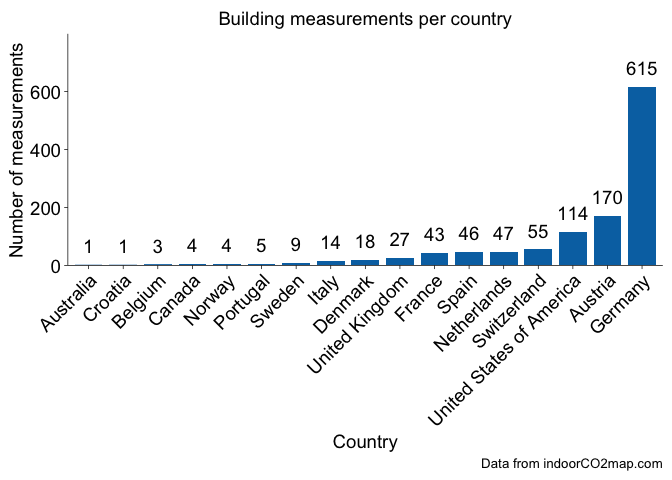
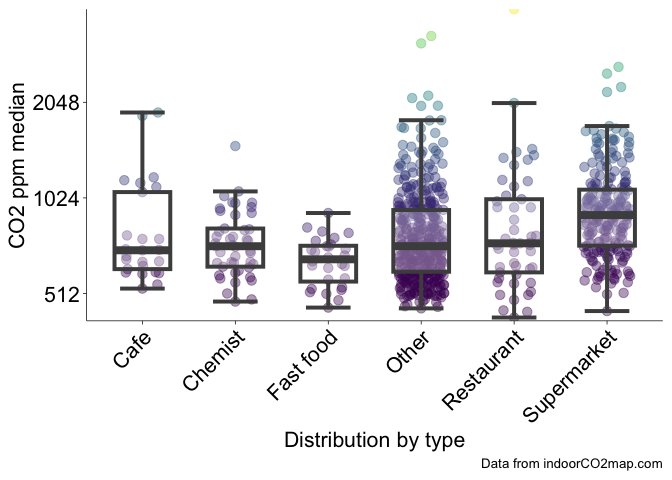
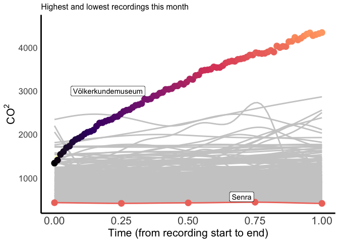
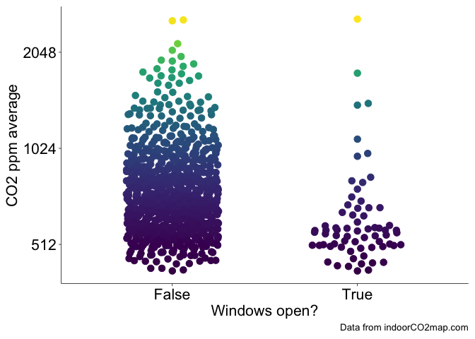

# Monthly indoorCO2map.com Summary for the month of September

## Buildings

This month there were 1195 measurements of 888 unique buildings. The
most measured building was Caritas-Krankenhaus Sankt Josef, a hospital
in Regensburg, Deutschland (min: 505, mean: 778, max: 1086), which was
measured 15 times.

The building with the highest measured CO2 levels was
Bibliothèque Arts et multimédia in Seine-Saint-Denis, France with a
median CO2 value of 2601 ppm. The buildings with the lowest
measured CO2 levels were Big Fernand in Brest, France and
Hôtel Le Vauban in Brest, France with median CO2 values of
423 ppm. There were some measurements that were even lower than this,
but we have removed them from this analysis. Generally outdoor
CO2 levels don’t go below 410 ppm, therefore we have removed
any datapoints that are below 400 ppm. If your CO2 monitor
consistently shows levels below 410 ppm while you are inside or outside,
it is likely that your monitor needs recalibrating.

Here is a graph of all the recordings that happened this month shown by
the grey curves. I’ve highlighted the highest and lowest ones.

Here is a chart showing the 51 measurements that had a median
CO2 value under 500. Keep in mind that some of these are
potentially miscalibrated sensors or erroneous recordings where the
sensor was outside. However, it is important to celebrate the places
that do in fact have well ventilated spaces.

| Name                                           | Median CO2 | Building type       | Location                                |
|:-----------------------------------------------|----------------------:|:--------------------|:----------------------------------------|
| Buddha Kitchen                                 |                 490.0 | Restaurant          | Hamburg, Deutschland                    |
| Decathlon                                      |                 475.0 | Sports              | NA                                      |
| La PAM                                         |                 461.0 | Mall                | Brest, France                           |
| Opera Caféen                                   |                 472.5 | Cafe                | København, Danmark                      |
| Lagerhaus                                      |                 483.0 | Doityourself        | Bezirk Korneuburg, Österreich           |
| Tao Mini Bar                                   |                 480.5 | Restaurant          | Wien, Österreich                        |
| ese O ese                                      |                 484.0 | Clothes             | Zaragoza, España                        |
| Draulic                                        |                 450.0 | Restaurant          | Alt Empordà, España                     |
| O Bún                                          |                 439.0 | Fast_food           | Brest, France                           |
| Pepco                                          |                 475.0 | Clothes             | Santiago de Compostela, España          |
| Matcha Komatchi Lerchenfelder Straße           |                 498.0 | Restaurant          | Wien, Österreich                        |
| Feast At The Mills                             |                 464.0 | Restaurant          | England, United Kingdom                 |
| Merkal                                         |                 485.0 | Shoes               | Alt Empordà, España                     |
| Pizzeria Giangi                                |                 453.5 | Restaurant          | NA                                      |
| Museo del Puerto Fluvial de Caesaraugusta      |                 473.0 | Museum              | Zaragoza, España                        |
| Slagter og Mad                                 |                 437.0 | Butcher             | København, Danmark                      |
| Women’secret                                   |                 474.0 | Clothes             | Zaragoza, España                        |
| Het Zwaailicht                                 |                 485.0 | Clothes             | Zeeland, Nederland                      |
| Müller                                         |                 489.0 | Chemist             | Rhein-Erft-Kreis, Deutschland           |
| Delft                                          |                 462.5 | Station             | Delft, Nederland                        |
|                                                |                 480.5 | Kiosk               | Essen, Deutschland                      |
| Cineplex Germering                             |                 459.0 | Cinema              | Landkreis Fürstenfeldbruck, Deutschland |
| Interio                                        |                 471.0 | Interior_decoration | Wien, Österreich                        |
| Celler Clos Figueras & Restaurant Les Figueres |                 446.0 | Restaurant          | Priorat, España                         |
| Som Kitchen                                    |                 454.0 | Fast_food           | Wien, Österreich                        |
| Biocoop                                        |                 451.0 | Supermarket         | NA                                      |
| Trondheim folkebibliotek, Moholt               |                 452.0 | Library             | Trondheim, Norge                        |
| Alnor                                          |                 487.0 | Restaurant          | NA                                      |
| Big Fernand                                    |                 423.0 | Fast_food           | Brest, France                           |
| Senra                                          |                 431.0 | Restaurant          | Bidasoa Beherea / Bajo Bidasoa, España  |
| Les Gâteuses                                   |                 455.5 | Cafe                | Brest, France                           |
| Döner Point                                    |                 448.0 | Fast_food           | Göttingen, Deutschland                  |
| Hôtel Le Vauban                                |                 423.0 | Hotel               | Brest, France                           |
| OBI                                            |                 447.0 | Doityourself        | Landkreis Forchheim, Deutschland        |
| Carrefour City                                 |                 433.0 | Convenience         | Brest, France                           |
| La Fabrik 1801                                 |                 483.0 | Bar                 | Brest, France                           |
| Dornier Museum Friedrichshafen                 |                 485.0 | Museum              | Bodenseekreis, Deutschland              |
| T2 - International                             |                 492.0 | Terminal            | Melbourne, Australia                    |
| Universitätsklinikum Münster                   |                 431.0 | Hospital            | Münster, Deutschland                    |
| KFC                                            |                 485.5 | Fast_food           | Aube, France                            |
| Hinds Hall                                     |                 499.0 |                     | City of Syracuse, United States         |
| Kunsthalle Tübingen                            |                 468.5 | Museum              | Landkreis Tübingen, Deutschland         |
| Museum für Kunst und Kulturgeschichte          |                 491.0 | Museum              | Dortmund, Deutschland                   |
| Kaufmannshaus                                  |                 456.5 | Mall                | Hamburg, Deutschland                    |
| Globus Baumarkt                                |                 480.0 | Doityourself        | Rhein-Erft-Kreis, Deutschland           |
| Trib’s                                         |                 425.5 | Convenience         | Brest, France                           |
| Ibis Hamburg St. Pauli Messe                   |                 498.5 | Hotel               | Hamburg, Deutschland                    |
| Hotel Odeon                                    |                 469.0 | Hotel               | Odense, Danmark                         |
| Acuario de Zaragoza                            |                 479.0 | Aquarium            | Zaragoza, España                        |
| Gare Montparnasse                              |                 445.0 |                     | Paris, France                           |
| Tagungszentrum                                 |                 484.5 |                     | Göttingen, Deutschland                  |

## Trends over time

The following are charts that are updated every month, but they reflect
all data collected so far from the indoorco2 monitoring project (since
April 2024). Over time, we should be able to see yearly trends where
CO2 levels are higher in the Winter when shopkeepers close
their windows to keep things warm and then lower CO2 levels
when shopkeepers open their windows in the Summer.  
We can start to see trends like this in the following graph which graphs
CO2 against the week of the year. There are two relevant
points you should know about the X axis
`Week of the year (meteorological)`.

1.  Datapoints are aggregated into weeks regardless of the year they are
    collected in, so some weeks were measured in both 2024 and 2025 but
    they would both show up in the same week number.

2.  This takes account of the hemisphere in which the recording was
    collected. Since Winter in the Southern Hemisphere is June through
    August, while Winter in the Northern Hemisphere is December through
    February, we have adjusted the week numbers so that they line up
    meterologically. Essentially, a measurement collected in the
    Northern Hemisphere on the first of January would show up as week 1,
    however, a measurement collected in the Southern Hemisphere on the
    first of January would show up as week 27.

If we split the graph by the four most popular building types, we can
start to see some interesting trends. Supermarkets remain relatively
high throughout the year with little variation while fast food, and
chemists have quite a strong dip in CO2 levels during the
Summer. This may be because most supermarkets keep their doors closed
throughout the year and they tend to have larger buildings; conversely,
chemists and fast food restraunts tend to be small to medium sized
buildings which means that they can be very easily ventilated if they
leave their front door open in the Summer. Restaurants have a very
interesting trend here, the strong upward trend of the model at the end
of the year is probably due to not enough measurements of restaurants
yet rather that there being any meaningful conclusions. Over time we
should hopefully see more stable trends show up.

Here’s a histogram showing how many measurements have been recorded each
week since the start of the project. Over the last 12 months there have
been 10140 building measurements this year which is 845 per month or 195
per week.

<!-- ## Transit -->
<!-- ## Everything -->
<!-- Combine both long datasets and then make a beeswarm comparing buildings to transit -->
