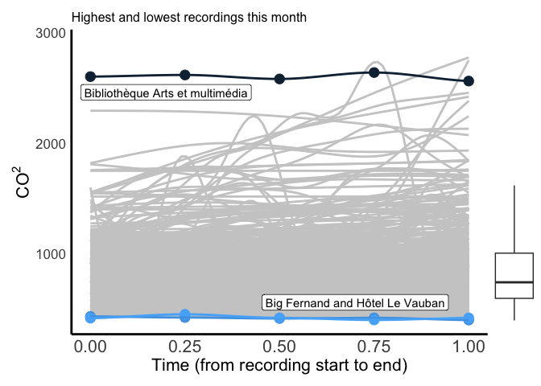
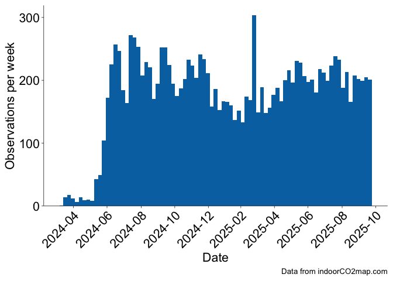
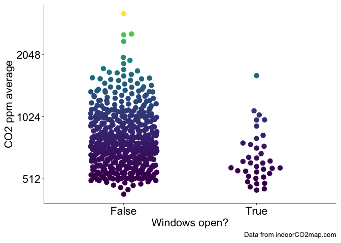

# Monthly indoorCO2map.com summary for October 2025

## Buildings

This month there were 969 measurements of 738 unique buildings. The most
measured building was Caritas-Krankenhaus Sankt Josef, a hospital in
Regensburg, Deutschland (min: 505, mean: 769, max: 1086), which was
measured 14 times.

There were measurements in 17 seperate countries. Additionally, the
first measurement was added in Gibraltar this month. Welcome to the
glorious world of CO2 monitoring Gibraltar! The following
graph shows the distribution of the most common building types in the
month of October.

The building with the highest measured CO2 levels was yves’s
in Potsdam-Mittelmark, Deutschland with a median CO2 value of
4017.5 ppm. The building with the lowest measured CO2 levels
was Senra in Bidasoa Beherea / Bajo Bidasoa, España with a median
CO2 value of 431 ppm. There were some measurements that were
even lower than this, but we have removed them from this analysis.
Generally outdoor CO2 levels don’t go below 410 ppm,
therefore we have removed any datapoints that are below 400 ppm. If your
CO2 monitor consistently shows levels below 410 ppm while you
are inside or outside, it is likely that your monitor needs
recalibrating.

Here is a graph of all the recordings that happened this month shown by
the grey curves. I’ve highlighted the highest and lowest ones.

Here is a chart showing the 18 measurements that had a median
CO2 value under 500. Keep in mind that some of these are
potentially miscalibrated sensors or erroneous recordings where the
sensor was outside. However, it is important to celebrate the places
that do in fact have well ventilated spaces.

| Name                                                      | Median CO2 | Building type       | Location                               |
|:----------------------------------------------------------|----------------------:|:--------------------|:---------------------------------------|
| Decathlon                                                 |                 475.0 | Sports              | L’Aquila, Italia                       |
| Ebullition                                                |                 495.0 | Interior_decoration | Brest, France                          |
| Pizzeria Giangi                                           |                 453.5 | Restaurant          | Chieti, Italia                         |
| Marina Restaurant                                         |                 451.0 | Restaurant          | Primorsko-goranska županija, Hrvatska  |
| Müller                                                    |                 489.0 | Chemist             | Rhein-Erft-Kreis, Deutschland          |
| Frankfurt am Main Flughafen Fernbahnhof                   |                 463.0 | Station             | Frankfurt am Main, Deutschland         |
| Gibraltar International Airport (Arrivals and Departures) |                 499.0 | Terminal            | Gibraltar, Gibraltar                   |
| Som Kitchen                                               |                 464.5 | Fast_food           | Wien, Österreich                       |
| Biocoop                                                   |                 451.0 | Supermarket         | Brest, France                          |
| Alnor                                                     |                 487.0 | Restaurant          | Leipzig, Deutschland                   |
| Deutzer Asia Imbiss                                       |                 484.0 | Fast_food           | Köln, Deutschland                      |
| Senra                                                     |                 431.0 | Restaurant          | Bidasoa Beherea / Bajo Bidasoa, España |
| Döner Point                                               |                 457.5 | Fast_food           | Göttingen, Deutschland                 |
| Les bocaux d’Ana                                          |                 467.5 | Convenience         | Brest, France                          |
| La Fabrik 1801                                            |                 483.0 | Bar                 | Brest, France                          |
| T2 - International                                        |                 492.0 | Terminal            | Melbourne, Australia                   |
| Schillertheater                                           |                 481.0 | Theatre             | Berlin, Deutschland                    |
| Dortmunder U – Zentrum für Kunst und Kreativität          |                 477.0 | Museum              | Dortmund, Deutschland                  |

## Trends over time

The following are charts that are updated every month, but they reflect
all data collected so far from the indoorco2 monitoring project (since
April 2024). Over time, we should be able to see yearly trends where
CO2 levels are higher in the Winter when shopkeepers close
their windows to keep things warm and then lower CO2 levels
when shopkeepers open their windows in the Summer.  
We can start to see trends like this in the following graph which graphs
CO2 against the week of the year. There are two relevant
points you should know about the X axis
`Week of the year (meteorological)`.

1.  Datapoints are aggregated into weeks regardless of the year they are
    collected in, so some weeks were measured in both 2024 and 2025 but
    they would both show up in the same week number.

2.  This takes account of the hemisphere in which the recording was
    collected. Since Winter in the Southern Hemisphere is June through
    August, while Winter in the Northern Hemisphere is December through
    February, we have adjusted the week numbers so that they line up
    meterologically. Essentially, a measurement collected in the
    Northern Hemisphere on the first of January would show up as week 1,
    however, a measurement collected in the Southern Hemisphere on the
    first of January would show up as week 27.

If we split the graph by the most popular building types, we can start
to see some interesting trends. Supermarkets remain relatively high
throughout the year with little variation while fast food, and chemists
have quite a strong dip in CO2 levels during the Summer. This
may be because most supermarkets keep their doors closed throughout the
year and they tend to have larger buildings; conversely, chemists and
fast food restraunts tend to be small to medium sized buildings which
means that they can be very easily ventilated if they leave their front
door open in the Summer. Restaurants have a very interesting trend here,
the strong upward trend of the model at the end of the year is probably
due to not enough measurements of restaurants yet rather that there
being any meaningful conclusions. Over time we should hopefully see more
stable trends show up.

Here’s a histogram showing how many measurements have been recorded each
week since the start of the project. Over the last 12 months there have
been 10250 building measurements which is 854 per month or 197 per week.

## Transit

This month there were 215 measurements of 96 unique transit lines. The
most measured transit line was subway U6 in the U-Bahn Wien transit
network in Wien, Österreich (min: 482, mean: 700, max: 1006), which was
measured 14 times. The below graph shows the number of transit
recordings in each transit network during the last month. Keep in mind
that this graph only shows networks with more than 2 transit recordings
this month (there were quite a few with one or two). Transit recordings
seem very popular in Vienna and Munich at the moment.

When we look at the distribution of CO2 measurements by the
transit type this month we can see some paterns. Trains often have
higher CO2 values than buses, subways and trams because they
usually travel for longer distances between stations. This causes trains
to rely more heavily on mechanical ventilation than buses, subways, and
trams which open their doors at stations more frequently. This pattern
can be seen in the below graph.

This trend can also be seen when we look at the distribution of each
transit type on all the data from 2024 and 2025. You can see this in the
next graph.

That’s all for this month! Check back soon for more updates.

<!-- ## Everything -->
<!-- Combine both long datasets and then make a beeswarm comparing buildings to transit -->
