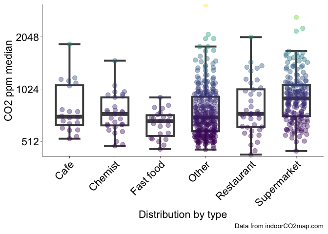

# Monthly Indoor CO2 Summary

# The monthly indoorCO2map.com summary

## Buildings

This month there were 1158 measurements of 862 unique buildings. The
most measured building was Caritas-Krankenhaus Sankt Josef, a hospital
in Regensburg, Deutschland (min: 505, mean: 778, max: 1086), which was
measured 15 times.

The building with the highest measured CO2 levels was
Bibliothèque Arts et multimédia in Seine-Saint-Denis, France with a
median CO2 value of 2601 ppm. The buildings with the lowest
measured CO2 levels were Big Fernand in Brest, France and
Hôtel Le Vauban in Brest, France with median CO2 values of
423 ppm. There were some measurements that were even lower than this,
but we have removed them from this analysis. Generally outdoor
CO2 levels don’t go below 410 ppm, therefore we have removed
any datapoints that are below 400 ppm. If your CO2 monitor
consistently shows levels below 410 ppm while you are inside or outside,
it is likely that your monitor needs recalibrating.

Here is a graph of all the recordings that happened this month shown by
the grey curves. I’ve highlighted the highest and lowest ones.

## Trends over time

## Transit

## Everything

Combine both long datasets and then make a beeswarm comparing buildings
to transit

