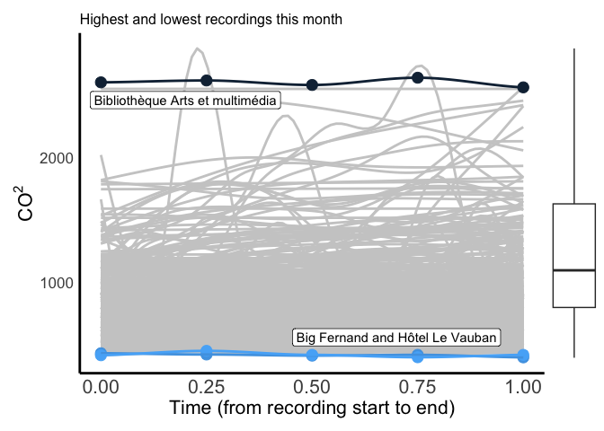
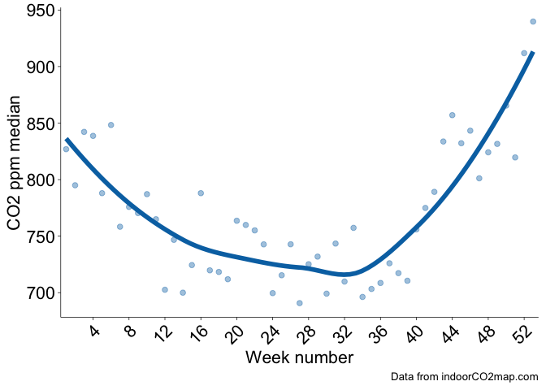

# Monthly indoorCO2map.com Summary for the month of September

## Buildings

This month there were 1188 measurements of 882 unique buildings. The
most measured building was Caritas-Krankenhaus Sankt Josef, a hospital
in Regensburg, Deutschland (min: 505, mean: 778, max: 1086), which was
measured 15 times.

The building with the highest measured CO2 levels was
Bibliothèque Arts et multimédia in Seine-Saint-Denis, France with a
median CO2 value of 2601 ppm. The buildings with the lowest
measured CO2 levels were Big Fernand in Brest, France and
Hôtel Le Vauban in Brest, France with median CO2 values of
423 ppm. There were some measurements that were even lower than this,
but we have removed them from this analysis. Generally outdoor
CO2 levels don’t go below 410 ppm, therefore we have removed
any datapoints that are below 400 ppm. If your CO2 monitor
consistently shows levels below 410 ppm while you are inside or outside,
it is likely that your monitor needs recalibrating.

Here is a chart showing the 51 measurements that had a median
CO2 value under 500. Keep in mind that some of these are
potentially miscalibrated sensors or erroneous recordings where the
sensor was outside. However, it is important to celebrate the places
that do in fact have well ventilated spaces.

| Name                                           | Median CO2 | Building type       | Location                                |
|:-----------------------------------------------|----------------------:|:--------------------|:----------------------------------------|
| Buddha Kitchen                                 |                 490.0 | Restaurant          | Hamburg, Deutschland                    |
| Decathlon                                      |                 475.0 | Sports              | NA                                      |
| La PAM                                         |                 461.0 | Mall                | Brest, France                           |
| Opera Caféen                                   |                 472.5 | Cafe                | København, Danmark                      |
| Lagerhaus                                      |                 483.0 | Doityourself        | Bezirk Korneuburg, Österreich           |
| Tao Mini Bar                                   |                 480.5 | Restaurant          | Wien, Österreich                        |
| ese O ese                                      |                 484.0 | Clothes             | Zaragoza, España                        |
| Draulic                                        |                 450.0 | Restaurant          | Alt Empordà, España                     |
| O Bún                                          |                 439.0 | Fast_food           | Brest, France                           |
| Pepco                                          |                 475.0 | Clothes             | Santiago de Compostela, España          |
| Matcha Komatchi Lerchenfelder Straße           |                 498.0 | Restaurant          | Wien, Österreich                        |
| Feast At The Mills                             |                 464.0 | Restaurant          | England, United Kingdom                 |
| Merkal                                         |                 485.0 | Shoes               | Alt Empordà, España                     |
| Pizzeria Giangi                                |                 453.5 | Restaurant          | NA                                      |
| Museo del Puerto Fluvial de Caesaraugusta      |                 473.0 | Museum              | Zaragoza, España                        |
| Slagter og Mad                                 |                 437.0 | Butcher             | København, Danmark                      |
| Women’secret                                   |                 474.0 | Clothes             | Zaragoza, España                        |
| Het Zwaailicht                                 |                 485.0 | Clothes             | Zeeland, Nederland                      |
| Müller                                         |                 489.0 | Chemist             | Rhein-Erft-Kreis, Deutschland           |
| Delft                                          |                 462.5 | Station             | Delft, Nederland                        |
|                                                |                 480.5 | Kiosk               | Essen, Deutschland                      |
| Cineplex Germering                             |                 459.0 | Cinema              | Landkreis Fürstenfeldbruck, Deutschland |
| Interio                                        |                 471.0 | Interior_decoration | Wien, Österreich                        |
| Celler Clos Figueras & Restaurant Les Figueres |                 446.0 | Restaurant          | Priorat, España                         |
| Som Kitchen                                    |                 454.0 | Fast_food           | Wien, Österreich                        |
| Biocoop                                        |                 451.0 | Supermarket         | NA                                      |
| Trondheim folkebibliotek, Moholt               |                 452.0 | Library             | Trondheim, Norge                        |
| Alnor                                          |                 487.0 | Restaurant          | NA                                      |
| Big Fernand                                    |                 423.0 | Fast_food           | Brest, France                           |
| Senra                                          |                 431.0 | Restaurant          | Bidasoa Beherea / Bajo Bidasoa, España  |
| Les Gâteuses                                   |                 455.5 | Cafe                | Brest, France                           |
| Döner Point                                    |                 448.0 | Fast_food           | Göttingen, Deutschland                  |
| Hôtel Le Vauban                                |                 423.0 | Hotel               | Brest, France                           |
| OBI                                            |                 447.0 | Doityourself        | Landkreis Forchheim, Deutschland        |
| Carrefour City                                 |                 433.0 | Convenience         | Brest, France                           |
| La Fabrik 1801                                 |                 483.0 | Bar                 | Brest, France                           |
| Dornier Museum Friedrichshafen                 |                 485.0 | Museum              | Bodenseekreis, Deutschland              |
| T2 - International                             |                 492.0 | Terminal            | Melbourne, Australia                    |
| Universitätsklinikum Münster                   |                 431.0 | Hospital            | Münster, Deutschland                    |
| KFC                                            |                 485.5 | Fast_food           | Aube, France                            |
| Hinds Hall                                     |                 499.0 |                     | City of Syracuse, United States         |
| Kunsthalle Tübingen                            |                 468.5 | Museum              | Landkreis Tübingen, Deutschland         |
| Museum für Kunst und Kulturgeschichte          |                 491.0 | Museum              | Dortmund, Deutschland                   |
| Kaufmannshaus                                  |                 456.5 | Mall                | Hamburg, Deutschland                    |
| Globus Baumarkt                                |                 480.0 | Doityourself        | Rhein-Erft-Kreis, Deutschland           |
| Trib’s                                         |                 425.5 | Convenience         | Brest, France                           |
| Ibis Hamburg St. Pauli Messe                   |                 498.5 | Hotel               | Hamburg, Deutschland                    |
| Hotel Odeon                                    |                 469.0 | Hotel               | Odense, Danmark                         |
| Acuario de Zaragoza                            |                 479.0 | Aquarium            | Zaragoza, España                        |
| Gare Montparnasse                              |                 445.0 |                     | Paris, France                           |
| Tagungszentrum                                 |                 484.5 |                     | Göttingen, Deutschland                  |

Here is a graph of all the recordings that happened this month shown by
the grey curves. I’ve highlighted the highest and lowest ones.

## Trends over time

## Transit

## Everything

Combine both long datasets and then make a beeswarm comparing buildings
to transit
