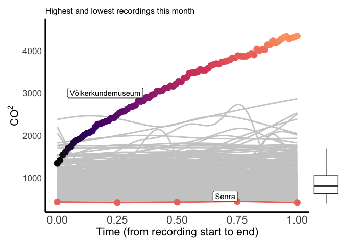
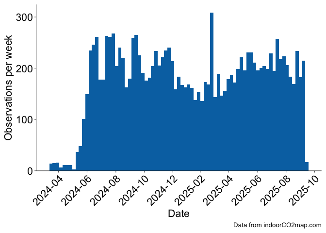

# Monthly indoorCO2map.com Summary

# Summary for the month of September

## Buildings

This month there were 1188 measurements of 882 unique buildings. The
most measured building was Caritas-Krankenhaus Sankt Josef, a hospital
in Regensburg, Deutschland (min: 505, mean: 778, max: 1086), which was
measured 15 times.

The building with the highest measured CO2 levels was
Bibliothèque Arts et multimédia in Seine-Saint-Denis, France with a
median CO2 value of 2601 ppm. The buildings with the lowest
measured CO2 levels were Big Fernand in Brest, France and
Hôtel Le Vauban in Brest, France with median CO2 values of
423 ppm. There were some measurements that were even lower than this,
but we have removed them from this analysis. Generally outdoor
CO2 levels don’t go below 410 ppm, therefore we have removed
any datapoints that are below 400 ppm. If your CO2 monitor
consistently shows levels below 410 ppm while you are inside or outside,
it is likely that your monitor needs recalibrating.

Here is a chart showing the 51 measurements that had a median
CO2 value under 500. Keep in mind that some of these are
potentially miscalibrated sensors or erroneous recordings where the
sensor was outside. However, it is important to celebrate the places
that do in fact have well ventilated spaces.

| Measurements under 500 ppm                     |         |                     |                                         |
|------------------------------------------------|---------|---------------------|-----------------------------------------|
| Name                                           | CO2 ppm | Building type       | Location                                |
| Buddha Kitchen                                 | 490.0   | Restaurant          | Hamburg, Deutschland                    |
| Decathlon                                      | 475.0   | Sports              | NA                                      |
| La PAM                                         | 461.0   | Mall                | Brest, France                           |
| Opera Caféen                                   | 472.5   | Cafe                | København, Danmark                      |
| Lagerhaus                                      | 483.0   | Doityourself        | Bezirk Korneuburg, Österreich           |
| Tao Mini Bar                                   | 480.5   | Restaurant          | Wien, Österreich                        |
| ese O ese                                      | 484.0   | Clothes             | Zaragoza, España                        |
| Draulic                                        | 450.0   | Restaurant          | Alt Empordà, España                     |
| O Bún                                          | 439.0   | Fast_food           | Brest, France                           |
| Pepco                                          | 475.0   | Clothes             | Santiago de Compostela, España          |
| Matcha Komatchi Lerchenfelder Straße           | 498.0   | Restaurant          | Wien, Österreich                        |
| Feast At The Mills                             | 464.0   | Restaurant          | England, United Kingdom                 |
| Merkal                                         | 485.0   | Shoes               | Alt Empordà, España                     |
| Pizzeria Giangi                                | 453.5   | Restaurant          | NA                                      |
| Museo del Puerto Fluvial de Caesaraugusta      | 473.0   | Museum              | Zaragoza, España                        |
| Slagter og Mad                                 | 437.0   | Butcher             | København, Danmark                      |
| Women'secret                                   | 474.0   | Clothes             | Zaragoza, España                        |
| Het Zwaailicht                                 | 485.0   | Clothes             | Zeeland, Nederland                      |
| Müller                                         | 489.0   | Chemist             | Rhein-Erft-Kreis, Deutschland           |
| Delft                                          | 462.5   | Station             | Delft, Nederland                        |
|                                                | 480.5   | Kiosk               | Essen, Deutschland                      |
| Cineplex Germering                             | 459.0   | Cinema              | Landkreis Fürstenfeldbruck, Deutschland |
| Interio                                        | 471.0   | Interior_decoration | Wien, Österreich                        |
| Celler Clos Figueras & Restaurant Les Figueres | 446.0   | Restaurant          | Priorat, España                         |
| Som Kitchen                                    | 454.0   | Fast_food           | Wien, Österreich                        |
| Biocoop                                        | 451.0   | Supermarket         | NA                                      |
| Trondheim folkebibliotek, Moholt               | 452.0   | Library             | Trondheim, Norge                        |
| Alnor                                          | 487.0   | Restaurant          | NA                                      |
| Big Fernand                                    | 423.0   | Fast_food           | Brest, France                           |
| Senra                                          | 431.0   | Restaurant          | Bidasoa Beherea / Bajo Bidasoa, España  |
| Les Gâteuses                                   | 455.5   | Cafe                | Brest, France                           |
| Döner Point                                    | 448.0   | Fast_food           | Göttingen, Deutschland                  |
| Hôtel Le Vauban                                | 423.0   | Hotel               | Brest, France                           |
| OBI                                            | 447.0   | Doityourself        | Landkreis Forchheim, Deutschland        |
| Carrefour City                                 | 433.0   | Convenience         | Brest, France                           |
| La Fabrik 1801                                 | 483.0   | Bar                 | Brest, France                           |
| Dornier Museum Friedrichshafen                 | 485.0   | Museum              | Bodenseekreis, Deutschland              |
| T2 - International                             | 492.0   | Terminal            | Melbourne, Australia                    |
| Universitätsklinikum Münster                   | 431.0   | Hospital            | Münster, Deutschland                    |
| KFC                                            | 485.5   | Fast_food           | Aube, France                            |
| Hinds Hall                                     | 499.0   |                     | City of Syracuse, United States         |
| Kunsthalle Tübingen                            | 468.5   | Museum              | Landkreis Tübingen, Deutschland         |
| Museum für Kunst und Kulturgeschichte          | 491.0   | Museum              | Dortmund, Deutschland                   |
| Kaufmannshaus                                  | 456.5   | Mall                | Hamburg, Deutschland                    |
| Globus Baumarkt                                | 480.0   | Doityourself        | Rhein-Erft-Kreis, Deutschland           |
| Trib's                                         | 425.5   | Convenience         | Brest, France                           |
| Ibis Hamburg St. Pauli Messe                   | 498.5   | Hotel               | Hamburg, Deutschland                    |
| Hotel Odeon                                    | 469.0   | Hotel               | Odense, Danmark                         |
| Acuario de Zaragoza                            | 479.0   | Aquarium            | Zaragoza, España                        |
| Gare Montparnasse                              | 445.0   |                     | Paris, France                           |
| Tagungszentrum                                 | 484.5   |                     | Göttingen, Deutschland                  |

Here is a graph of all the recordings that happened this month shown by
the grey curves. I’ve highlighted the highest and lowest ones.

    `geom_smooth()` using method = 'gam' and formula = 'y ~ s(x, bs = "cs")'

    Warning: Failed to fit group 1.
    Caused by error in `smooth.construct.cr.smooth.spec()`:
    ! x has insufficient unique values to support 10 knots: reduce k.

    Warning: Failed to fit group 2.
    Caused by error in `smooth.construct.cr.smooth.spec()`:
    ! x has insufficient unique values to support 10 knots: reduce k.

    Warning: Failed to fit group 3.
    Caused by error in `smooth.construct.cr.smooth.spec()`:
    ! x has insufficient unique values to support 10 knots: reduce k.

    Warning: Failed to fit group 5.
    Caused by error in `smooth.construct.cr.smooth.spec()`:
    ! x has insufficient unique values to support 10 knots: reduce k.

    Warning: Failed to fit group 7.
    Caused by error in `smooth.construct.cr.smooth.spec()`:
    ! x has insufficient unique values to support 10 knots: reduce k.

    Warning: Failed to fit group 9.
    Caused by error in `smooth.construct.cr.smooth.spec()`:
    ! x has insufficient unique values to support 10 knots: reduce k.

    Warning: Failed to fit group 12.
    Caused by error in `smooth.construct.cr.smooth.spec()`:
    ! x has insufficient unique values to support 10 knots: reduce k.

    Warning: Failed to fit group 18.
    Caused by error in `smooth.construct.cr.smooth.spec()`:
    ! x has insufficient unique values to support 10 knots: reduce k.

    Warning: Failed to fit group 19.
    Caused by error in `smooth.construct.cr.smooth.spec()`:
    ! x has insufficient unique values to support 10 knots: reduce k.

    Warning: Failed to fit group 21.
    Caused by error in `smooth.construct.cr.smooth.spec()`:
    ! x has insufficient unique values to support 10 knots: reduce k.

    Warning: Failed to fit group 23.
    Caused by error in `smooth.construct.cr.smooth.spec()`:
    ! x has insufficient unique values to support 10 knots: reduce k.

    Warning: Failed to fit group 35.
    Caused by error in `smooth.construct.cr.smooth.spec()`:
    ! x has insufficient unique values to support 10 knots: reduce k.

    Warning: Failed to fit group 37.
    Caused by error in `smooth.construct.cr.smooth.spec()`:
    ! x has insufficient unique values to support 10 knots: reduce k.

    Warning: Failed to fit group 38.
    Caused by error in `smooth.construct.cr.smooth.spec()`:
    ! x has insufficient unique values to support 10 knots: reduce k.

    Warning: Failed to fit group 43.
    Caused by error in `smooth.construct.cr.smooth.spec()`:
    ! x has insufficient unique values to support 10 knots: reduce k.

    Warning: Failed to fit group 55.
    Caused by error in `smooth.construct.cr.smooth.spec()`:
    ! x has insufficient unique values to support 10 knots: reduce k.

    Warning: Failed to fit group 58.
    Caused by error in `smooth.construct.cr.smooth.spec()`:
    ! x has insufficient unique values to support 10 knots: reduce k.

    Warning: Failed to fit group 65.
    Caused by error in `smooth.construct.cr.smooth.spec()`:
    ! x has insufficient unique values to support 10 knots: reduce k.

    Warning: Failed to fit group 67.
    Caused by error in `smooth.construct.cr.smooth.spec()`:
    ! x has insufficient unique values to support 10 knots: reduce k.

    Warning: Failed to fit group 69.
    Caused by error in `smooth.construct.cr.smooth.spec()`:
    ! x has insufficient unique values to support 10 knots: reduce k.

    Warning: Failed to fit group 75.
    Caused by error in `smooth.construct.cr.smooth.spec()`:
    ! x has insufficient unique values to support 10 knots: reduce k.

    Warning: Failed to fit group 79.
    Caused by error in `smooth.construct.cr.smooth.spec()`:
    ! x has insufficient unique values to support 10 knots: reduce k.

    Warning: Failed to fit group 81.
    Caused by error in `smooth.construct.cr.smooth.spec()`:
    ! x has insufficient unique values to support 10 knots: reduce k.

    Warning: Failed to fit group 82.
    Caused by error in `smooth.construct.cr.smooth.spec()`:
    ! x has insufficient unique values to support 10 knots: reduce k.

    Warning: Failed to fit group 83.
    Caused by error in `smooth.construct.cr.smooth.spec()`:
    ! x has insufficient unique values to support 10 knots: reduce k.

    Warning: Failed to fit group 84.
    Caused by error in `smooth.construct.cr.smooth.spec()`:
    ! x has insufficient unique values to support 10 knots: reduce k.

    Warning: Failed to fit group 85.
    Caused by error in `smooth.construct.cr.smooth.spec()`:
    ! x has insufficient unique values to support 10 knots: reduce k.

    Warning: Failed to fit group 87.
    Caused by error in `smooth.construct.cr.smooth.spec()`:
    ! x has insufficient unique values to support 10 knots: reduce k.

    Warning: Failed to fit group 88.
    Caused by error in `smooth.construct.cr.smooth.spec()`:
    ! x has insufficient unique values to support 10 knots: reduce k.

    Warning: Failed to fit group 90.
    Caused by error in `smooth.construct.cr.smooth.spec()`:
    ! x has insufficient unique values to support 10 knots: reduce k.

    Warning: Failed to fit group 95.
    Caused by error in `smooth.construct.cr.smooth.spec()`:
    ! x has insufficient unique values to support 10 knots: reduce k.

    Warning: Failed to fit group 98.
    Caused by error in `smooth.construct.cr.smooth.spec()`:
    ! x has insufficient unique values to support 10 knots: reduce k.

    Warning: Failed to fit group 100.
    Caused by error in `smooth.construct.cr.smooth.spec()`:
    ! x has insufficient unique values to support 10 knots: reduce k.

    Warning: Failed to fit group 102.
    Caused by error in `smooth.construct.cr.smooth.spec()`:
    ! x has insufficient unique values to support 10 knots: reduce k.

    Warning: Failed to fit group 104.
    Caused by error in `smooth.construct.cr.smooth.spec()`:
    ! x has insufficient unique values to support 10 knots: reduce k.

    Warning: Failed to fit group 105.
    Caused by error in `smooth.construct.cr.smooth.spec()`:
    ! x has insufficient unique values to support 10 knots: reduce k.

    Warning: Failed to fit group 108.
    Caused by error in `smooth.construct.cr.smooth.spec()`:
    ! x has insufficient unique values to support 10 knots: reduce k.

    Warning: Failed to fit group 109.
    Caused by error in `smooth.construct.cr.smooth.spec()`:
    ! x has insufficient unique values to support 10 knots: reduce k.

    Warning: Failed to fit group 116.
    Caused by error in `smooth.construct.cr.smooth.spec()`:
    ! x has insufficient unique values to support 10 knots: reduce k.

    Warning: Failed to fit group 117.
    Caused by error in `smooth.construct.cr.smooth.spec()`:
    ! x has insufficient unique values to support 10 knots: reduce k.

    Warning: Failed to fit group 118.
    Caused by error in `smooth.construct.cr.smooth.spec()`:
    ! x has insufficient unique values to support 10 knots: reduce k.

    Warning: Failed to fit group 119.
    Caused by error in `smooth.construct.cr.smooth.spec()`:
    ! x has insufficient unique values to support 10 knots: reduce k.

    Warning: Failed to fit group 121.
    Caused by error in `smooth.construct.cr.smooth.spec()`:
    ! x has insufficient unique values to support 10 knots: reduce k.

    Warning: Failed to fit group 127.
    Caused by error in `smooth.construct.cr.smooth.spec()`:
    ! x has insufficient unique values to support 10 knots: reduce k.

    Warning: Failed to fit group 139.
    Caused by error in `smooth.construct.cr.smooth.spec()`:
    ! x has insufficient unique values to support 10 knots: reduce k.

    Warning: Failed to fit group 140.
    Caused by error in `smooth.construct.cr.smooth.spec()`:
    ! x has insufficient unique values to support 10 knots: reduce k.

    Warning: Failed to fit group 143.
    Caused by error in `smooth.construct.cr.smooth.spec()`:
    ! x has insufficient unique values to support 10 knots: reduce k.

    Warning: Failed to fit group 144.
    Caused by error in `smooth.construct.cr.smooth.spec()`:
    ! x has insufficient unique values to support 10 knots: reduce k.

    Warning: Failed to fit group 151.
    Caused by error in `smooth.construct.cr.smooth.spec()`:
    ! x has insufficient unique values to support 10 knots: reduce k.

    Warning: Failed to fit group 154.
    Caused by error in `smooth.construct.cr.smooth.spec()`:
    ! x has insufficient unique values to support 10 knots: reduce k.

    Warning: Failed to fit group 156.
    Caused by error in `smooth.construct.cr.smooth.spec()`:
    ! x has insufficient unique values to support 10 knots: reduce k.

    Warning: Failed to fit group 158.
    Caused by error in `smooth.construct.cr.smooth.spec()`:
    ! x has insufficient unique values to support 10 knots: reduce k.

    Warning: Failed to fit group 161.
    Caused by error in `smooth.construct.cr.smooth.spec()`:
    ! x has insufficient unique values to support 10 knots: reduce k.

    Warning: Failed to fit group 162.
    Caused by error in `smooth.construct.cr.smooth.spec()`:
    ! x has insufficient unique values to support 10 knots: reduce k.

    Warning: Failed to fit group 163.
    Caused by error in `smooth.construct.cr.smooth.spec()`:
    ! x has insufficient unique values to support 10 knots: reduce k.

    Warning: Failed to fit group 167.
    Caused by error in `smooth.construct.cr.smooth.spec()`:
    ! x has insufficient unique values to support 10 knots: reduce k.

    Warning: Failed to fit group 177.
    Caused by error in `smooth.construct.cr.smooth.spec()`:
    ! x has insufficient unique values to support 10 knots: reduce k.

    Warning: Failed to fit group 191.
    Caused by error in `smooth.construct.cr.smooth.spec()`:
    ! x has insufficient unique values to support 10 knots: reduce k.

    Warning: Failed to fit group 194.
    Caused by error in `smooth.construct.cr.smooth.spec()`:
    ! x has insufficient unique values to support 10 knots: reduce k.

    Warning: Failed to fit group 209.
    Caused by error in `smooth.construct.cr.smooth.spec()`:
    ! x has insufficient unique values to support 10 knots: reduce k.

    Warning: Failed to fit group 212.
    Caused by error in `smooth.construct.cr.smooth.spec()`:
    ! x has insufficient unique values to support 10 knots: reduce k.

    Warning: Failed to fit group 215.
    Caused by error in `smooth.construct.cr.smooth.spec()`:
    ! x has insufficient unique values to support 10 knots: reduce k.

    Warning: Failed to fit group 216.
    Caused by error in `smooth.construct.cr.smooth.spec()`:
    ! x has insufficient unique values to support 10 knots: reduce k.

    Warning: Failed to fit group 217.
    Caused by error in `smooth.construct.cr.smooth.spec()`:
    ! x has insufficient unique values to support 10 knots: reduce k.

    Warning: Failed to fit group 220.
    Caused by error in `smooth.construct.cr.smooth.spec()`:
    ! x has insufficient unique values to support 10 knots: reduce k.

    Warning: Failed to fit group 225.
    Caused by error in `smooth.construct.cr.smooth.spec()`:
    ! x has insufficient unique values to support 10 knots: reduce k.

    Warning: Failed to fit group 226.
    Caused by error in `smooth.construct.cr.smooth.spec()`:
    ! x has insufficient unique values to support 10 knots: reduce k.

    Warning: Failed to fit group 236.
    Caused by error in `smooth.construct.cr.smooth.spec()`:
    ! x has insufficient unique values to support 10 knots: reduce k.

    Warning: Failed to fit group 241.
    Caused by error in `smooth.construct.cr.smooth.spec()`:
    ! x has insufficient unique values to support 10 knots: reduce k.

    Warning: Failed to fit group 243.
    Caused by error in `smooth.construct.cr.smooth.spec()`:
    ! x has insufficient unique values to support 10 knots: reduce k.

    Warning: Failed to fit group 246.
    Caused by error in `smooth.construct.cr.smooth.spec()`:
    ! x has insufficient unique values to support 10 knots: reduce k.

    Warning: Failed to fit group 253.
    Caused by error in `smooth.construct.cr.smooth.spec()`:
    ! x has insufficient unique values to support 10 knots: reduce k.

    Warning: Failed to fit group 258.
    Caused by error in `smooth.construct.cr.smooth.spec()`:
    ! x has insufficient unique values to support 10 knots: reduce k.

    Warning: Failed to fit group 259.
    Caused by error in `smooth.construct.cr.smooth.spec()`:
    ! x has insufficient unique values to support 10 knots: reduce k.

    Warning: Failed to fit group 264.
    Caused by error in `smooth.construct.cr.smooth.spec()`:
    ! x has insufficient unique values to support 10 knots: reduce k.

    Warning: Failed to fit group 266.
    Caused by error in `smooth.construct.cr.smooth.spec()`:
    ! x has insufficient unique values to support 10 knots: reduce k.

    Warning: Failed to fit group 269.
    Caused by error in `smooth.construct.cr.smooth.spec()`:
    ! x has insufficient unique values to support 10 knots: reduce k.

    Warning: Failed to fit group 276.
    Caused by error in `smooth.construct.cr.smooth.spec()`:
    ! x has insufficient unique values to support 10 knots: reduce k.

    Warning: Failed to fit group 283.
    Caused by error in `smooth.construct.cr.smooth.spec()`:
    ! x has insufficient unique values to support 10 knots: reduce k.

    Warning: Failed to fit group 284.
    Caused by error in `smooth.construct.cr.smooth.spec()`:
    ! x has insufficient unique values to support 10 knots: reduce k.

    Warning: Failed to fit group 286.
    Caused by error in `smooth.construct.cr.smooth.spec()`:
    ! x has insufficient unique values to support 10 knots: reduce k.

    Warning: Failed to fit group 288.
    Caused by error in `smooth.construct.cr.smooth.spec()`:
    ! x has insufficient unique values to support 10 knots: reduce k.

    Warning: Failed to fit group 291.
    Caused by error in `smooth.construct.cr.smooth.spec()`:
    ! x has insufficient unique values to support 10 knots: reduce k.

    Warning: Failed to fit group 300.
    Caused by error in `smooth.construct.cr.smooth.spec()`:
    ! x has insufficient unique values to support 10 knots: reduce k.

    Warning: Failed to fit group 306.
    Caused by error in `smooth.construct.cr.smooth.spec()`:
    ! x has insufficient unique values to support 10 knots: reduce k.

    Warning: Failed to fit group 308.
    Caused by error in `smooth.construct.cr.smooth.spec()`:
    ! x has insufficient unique values to support 10 knots: reduce k.

    Warning: Failed to fit group 311.
    Caused by error in `smooth.construct.cr.smooth.spec()`:
    ! x has insufficient unique values to support 10 knots: reduce k.

    Warning: Failed to fit group 316.
    Caused by error in `smooth.construct.cr.smooth.spec()`:
    ! x has insufficient unique values to support 10 knots: reduce k.

    Warning: Failed to fit group 326.
    Caused by error in `smooth.construct.cr.smooth.spec()`:
    ! x has insufficient unique values to support 10 knots: reduce k.

    Warning: Failed to fit group 328.
    Caused by error in `smooth.construct.cr.smooth.spec()`:
    ! x has insufficient unique values to support 10 knots: reduce k.

    Warning: Failed to fit group 332.
    Caused by error in `smooth.construct.cr.smooth.spec()`:
    ! x has insufficient unique values to support 10 knots: reduce k.

    Warning: Failed to fit group 336.
    Caused by error in `smooth.construct.cr.smooth.spec()`:
    ! x has insufficient unique values to support 10 knots: reduce k.

    Warning: Failed to fit group 339.
    Caused by error in `smooth.construct.cr.smooth.spec()`:
    ! x has insufficient unique values to support 10 knots: reduce k.

    Warning: Failed to fit group 342.
    Caused by error in `smooth.construct.cr.smooth.spec()`:
    ! x has insufficient unique values to support 10 knots: reduce k.

    Warning: Failed to fit group 343.
    Caused by error in `smooth.construct.cr.smooth.spec()`:
    ! x has insufficient unique values to support 10 knots: reduce k.

    Warning: Failed to fit group 350.
    Caused by error in `smooth.construct.cr.smooth.spec()`:
    ! x has insufficient unique values to support 10 knots: reduce k.

    Warning: Failed to fit group 351.
    Caused by error in `smooth.construct.cr.smooth.spec()`:
    ! x has insufficient unique values to support 10 knots: reduce k.

    Warning: Failed to fit group 352.
    Caused by error in `smooth.construct.cr.smooth.spec()`:
    ! x has insufficient unique values to support 10 knots: reduce k.

    Warning: Failed to fit group 353.
    Caused by error in `smooth.construct.cr.smooth.spec()`:
    ! x has insufficient unique values to support 10 knots: reduce k.

    Warning: Failed to fit group 354.
    Caused by error in `smooth.construct.cr.smooth.spec()`:
    ! x has insufficient unique values to support 10 knots: reduce k.

    Warning: Failed to fit group 355.
    Caused by error in `smooth.construct.cr.smooth.spec()`:
    ! x has insufficient unique values to support 10 knots: reduce k.

    Warning: Failed to fit group 360.
    Caused by error in `smooth.construct.cr.smooth.spec()`:
    ! x has insufficient unique values to support 10 knots: reduce k.

    Warning: Failed to fit group 361.
    Caused by error in `smooth.construct.cr.smooth.spec()`:
    ! x has insufficient unique values to support 10 knots: reduce k.

    Warning: Failed to fit group 368.
    Caused by error in `smooth.construct.cr.smooth.spec()`:
    ! x has insufficient unique values to support 10 knots: reduce k.

    Warning: Failed to fit group 369.
    Caused by error in `smooth.construct.cr.smooth.spec()`:
    ! x has insufficient unique values to support 10 knots: reduce k.

    Warning: Failed to fit group 374.
    Caused by error in `smooth.construct.cr.smooth.spec()`:
    ! x has insufficient unique values to support 10 knots: reduce k.

    Warning: Failed to fit group 375.
    Caused by error in `smooth.construct.cr.smooth.spec()`:
    ! x has insufficient unique values to support 10 knots: reduce k.

    Warning: Failed to fit group 385.
    Caused by error in `smooth.construct.cr.smooth.spec()`:
    ! x has insufficient unique values to support 10 knots: reduce k.

    Warning: Failed to fit group 389.
    Caused by error in `smooth.construct.cr.smooth.spec()`:
    ! x has insufficient unique values to support 10 knots: reduce k.

    Warning: Failed to fit group 401.
    Caused by error in `smooth.construct.cr.smooth.spec()`:
    ! x has insufficient unique values to support 10 knots: reduce k.

    Warning: Failed to fit group 402.
    Caused by error in `smooth.construct.cr.smooth.spec()`:
    ! x has insufficient unique values to support 10 knots: reduce k.

    Warning: Failed to fit group 404.
    Caused by error in `smooth.construct.cr.smooth.spec()`:
    ! x has insufficient unique values to support 10 knots: reduce k.

    Warning: Failed to fit group 405.
    Caused by error in `smooth.construct.cr.smooth.spec()`:
    ! x has insufficient unique values to support 10 knots: reduce k.

    Warning: Failed to fit group 406.
    Caused by error in `smooth.construct.cr.smooth.spec()`:
    ! x has insufficient unique values to support 10 knots: reduce k.

    Warning: Failed to fit group 409.
    Caused by error in `smooth.construct.cr.smooth.spec()`:
    ! x has insufficient unique values to support 10 knots: reduce k.

    Warning: Failed to fit group 415.
    Caused by error in `smooth.construct.cr.smooth.spec()`:
    ! x has insufficient unique values to support 10 knots: reduce k.

    Warning: Failed to fit group 418.
    Caused by error in `smooth.construct.cr.smooth.spec()`:
    ! x has insufficient unique values to support 10 knots: reduce k.

    Warning: Failed to fit group 419.
    Caused by error in `smooth.construct.cr.smooth.spec()`:
    ! x has insufficient unique values to support 10 knots: reduce k.

    Warning: Failed to fit group 420.
    Caused by error in `smooth.construct.cr.smooth.spec()`:
    ! x has insufficient unique values to support 10 knots: reduce k.

    Warning: Failed to fit group 430.
    Caused by error in `smooth.construct.cr.smooth.spec()`:
    ! x has insufficient unique values to support 10 knots: reduce k.

    Warning: Failed to fit group 432.
    Caused by error in `smooth.construct.cr.smooth.spec()`:
    ! x has insufficient unique values to support 10 knots: reduce k.

    Warning: Failed to fit group 435.
    Caused by error in `smooth.construct.cr.smooth.spec()`:
    ! x has insufficient unique values to support 10 knots: reduce k.

    Warning: Failed to fit group 436.
    Caused by error in `smooth.construct.cr.smooth.spec()`:
    ! x has insufficient unique values to support 10 knots: reduce k.

    Warning: Failed to fit group 446.
    Caused by error in `smooth.construct.cr.smooth.spec()`:
    ! x has insufficient unique values to support 10 knots: reduce k.

    Warning: Failed to fit group 451.
    Caused by error in `smooth.construct.cr.smooth.spec()`:
    ! x has insufficient unique values to support 10 knots: reduce k.

    Warning: Failed to fit group 460.
    Caused by error in `smooth.construct.cr.smooth.spec()`:
    ! x has insufficient unique values to support 10 knots: reduce k.

    Warning: Failed to fit group 462.
    Caused by error in `smooth.construct.cr.smooth.spec()`:
    ! x has insufficient unique values to support 10 knots: reduce k.

    Warning: Failed to fit group 464.
    Caused by error in `smooth.construct.cr.smooth.spec()`:
    ! x has insufficient unique values to support 10 knots: reduce k.

    Warning: Failed to fit group 466.
    Caused by error in `smooth.construct.cr.smooth.spec()`:
    ! x has insufficient unique values to support 10 knots: reduce k.

    Warning: Failed to fit group 468.
    Caused by error in `smooth.construct.cr.smooth.spec()`:
    ! x has insufficient unique values to support 10 knots: reduce k.

    Warning: Failed to fit group 472.
    Caused by error in `smooth.construct.cr.smooth.spec()`:
    ! x has insufficient unique values to support 10 knots: reduce k.

    Warning: Failed to fit group 473.
    Caused by error in `smooth.construct.cr.smooth.spec()`:
    ! x has insufficient unique values to support 10 knots: reduce k.

    Warning: Failed to fit group 476.
    Caused by error in `smooth.construct.cr.smooth.spec()`:
    ! x has insufficient unique values to support 10 knots: reduce k.

    Warning: Failed to fit group 480.
    Caused by error in `smooth.construct.cr.smooth.spec()`:
    ! x has insufficient unique values to support 10 knots: reduce k.

    Warning: Failed to fit group 482.
    Caused by error in `smooth.construct.cr.smooth.spec()`:
    ! x has insufficient unique values to support 10 knots: reduce k.

    Warning: Failed to fit group 484.
    Caused by error in `smooth.construct.cr.smooth.spec()`:
    ! x has insufficient unique values to support 10 knots: reduce k.

    Warning: Failed to fit group 492.
    Caused by error in `smooth.construct.cr.smooth.spec()`:
    ! x has insufficient unique values to support 10 knots: reduce k.

    Warning: Failed to fit group 493.
    Caused by error in `smooth.construct.cr.smooth.spec()`:
    ! x has insufficient unique values to support 10 knots: reduce k.

    Warning: Failed to fit group 494.
    Caused by error in `smooth.construct.cr.smooth.spec()`:
    ! x has insufficient unique values to support 10 knots: reduce k.

    Warning: Failed to fit group 508.
    Caused by error in `smooth.construct.cr.smooth.spec()`:
    ! x has insufficient unique values to support 10 knots: reduce k.

    Warning: Failed to fit group 516.
    Caused by error in `smooth.construct.cr.smooth.spec()`:
    ! x has insufficient unique values to support 10 knots: reduce k.

    Warning: Failed to fit group 522.
    Caused by error in `smooth.construct.cr.smooth.spec()`:
    ! x has insufficient unique values to support 10 knots: reduce k.

    Warning: Failed to fit group 531.
    Caused by error in `smooth.construct.cr.smooth.spec()`:
    ! x has insufficient unique values to support 10 knots: reduce k.

    Warning: Failed to fit group 534.
    Caused by error in `smooth.construct.cr.smooth.spec()`:
    ! x has insufficient unique values to support 10 knots: reduce k.

    Warning: Failed to fit group 539.
    Caused by error in `smooth.construct.cr.smooth.spec()`:
    ! x has insufficient unique values to support 10 knots: reduce k.

    Warning: Failed to fit group 541.
    Caused by error in `smooth.construct.cr.smooth.spec()`:
    ! x has insufficient unique values to support 10 knots: reduce k.

    Warning: Failed to fit group 544.
    Caused by error in `smooth.construct.cr.smooth.spec()`:
    ! x has insufficient unique values to support 10 knots: reduce k.

    Warning: Failed to fit group 549.
    Caused by error in `smooth.construct.cr.smooth.spec()`:
    ! x has insufficient unique values to support 10 knots: reduce k.

    Warning: Failed to fit group 556.
    Caused by error in `smooth.construct.cr.smooth.spec()`:
    ! x has insufficient unique values to support 10 knots: reduce k.

    Warning: Failed to fit group 562.
    Caused by error in `smooth.construct.cr.smooth.spec()`:
    ! x has insufficient unique values to support 10 knots: reduce k.

    Warning: Failed to fit group 566.
    Caused by error in `smooth.construct.cr.smooth.spec()`:
    ! x has insufficient unique values to support 10 knots: reduce k.

    Warning: Failed to fit group 572.
    Caused by error in `smooth.construct.cr.smooth.spec()`:
    ! x has insufficient unique values to support 10 knots: reduce k.

    Warning: Failed to fit group 589.
    Caused by error in `smooth.construct.cr.smooth.spec()`:
    ! x has insufficient unique values to support 10 knots: reduce k.

    Warning: Failed to fit group 598.
    Caused by error in `smooth.construct.cr.smooth.spec()`:
    ! x has insufficient unique values to support 10 knots: reduce k.

    Warning: Failed to fit group 603.
    Caused by error in `smooth.construct.cr.smooth.spec()`:
    ! x has insufficient unique values to support 10 knots: reduce k.

    Warning: Failed to fit group 629.
    Caused by error in `smooth.construct.cr.smooth.spec()`:
    ! x has insufficient unique values to support 10 knots: reduce k.

    Warning: Failed to fit group 632.
    Caused by error in `smooth.construct.cr.smooth.spec()`:
    ! x has insufficient unique values to support 10 knots: reduce k.

    Warning: Failed to fit group 635.
    Caused by error in `smooth.construct.cr.smooth.spec()`:
    ! x has insufficient unique values to support 10 knots: reduce k.

    Warning: Failed to fit group 638.
    Caused by error in `smooth.construct.cr.smooth.spec()`:
    ! x has insufficient unique values to support 10 knots: reduce k.

    Warning: Failed to fit group 641.
    Caused by error in `smooth.construct.cr.smooth.spec()`:
    ! x has insufficient unique values to support 10 knots: reduce k.

    Warning: Failed to fit group 648.
    Caused by error in `smooth.construct.cr.smooth.spec()`:
    ! x has insufficient unique values to support 10 knots: reduce k.

    Warning: Failed to fit group 662.
    Caused by error in `smooth.construct.cr.smooth.spec()`:
    ! x has insufficient unique values to support 10 knots: reduce k.

    Warning: Failed to fit group 678.
    Caused by error in `smooth.construct.cr.smooth.spec()`:
    ! x has insufficient unique values to support 10 knots: reduce k.

    Warning: Failed to fit group 680.
    Caused by error in `smooth.construct.cr.smooth.spec()`:
    ! x has insufficient unique values to support 10 knots: reduce k.

    Warning: Failed to fit group 686.
    Caused by error in `smooth.construct.cr.smooth.spec()`:
    ! x has insufficient unique values to support 10 knots: reduce k.

    Warning: Failed to fit group 692.
    Caused by error in `smooth.construct.cr.smooth.spec()`:
    ! x has insufficient unique values to support 10 knots: reduce k.

    Warning: Failed to fit group 702.
    Caused by error in `smooth.construct.cr.smooth.spec()`:
    ! x has insufficient unique values to support 10 knots: reduce k.

    Warning: Failed to fit group 728.
    Caused by error in `smooth.construct.cr.smooth.spec()`:
    ! x has insufficient unique values to support 10 knots: reduce k.

    Warning: Failed to fit group 729.
    Caused by error in `smooth.construct.cr.smooth.spec()`:
    ! x has insufficient unique values to support 10 knots: reduce k.

    Warning: Failed to fit group 739.
    Caused by error in `smooth.construct.cr.smooth.spec()`:
    ! x has insufficient unique values to support 10 knots: reduce k.

    Warning: Failed to fit group 742.
    Caused by error in `smooth.construct.cr.smooth.spec()`:
    ! x has insufficient unique values to support 10 knots: reduce k.

    Warning: Failed to fit group 743.
    Caused by error in `smooth.construct.cr.smooth.spec()`:
    ! x has insufficient unique values to support 10 knots: reduce k.

    Warning: Failed to fit group 750.
    Caused by error in `smooth.construct.cr.smooth.spec()`:
    ! x has insufficient unique values to support 10 knots: reduce k.

    Warning: Failed to fit group 752.
    Caused by error in `smooth.construct.cr.smooth.spec()`:
    ! x has insufficient unique values to support 10 knots: reduce k.

    Warning: Failed to fit group 766.
    Caused by error in `smooth.construct.cr.smooth.spec()`:
    ! x has insufficient unique values to support 10 knots: reduce k.

    Warning: Failed to fit group 770.
    Caused by error in `smooth.construct.cr.smooth.spec()`:
    ! x has insufficient unique values to support 10 knots: reduce k.

    Warning: Failed to fit group 773.
    Caused by error in `smooth.construct.cr.smooth.spec()`:
    ! x has insufficient unique values to support 10 knots: reduce k.

    Warning: Failed to fit group 775.
    Caused by error in `smooth.construct.cr.smooth.spec()`:
    ! x has insufficient unique values to support 10 knots: reduce k.

    Warning: Failed to fit group 783.
    Caused by error in `smooth.construct.cr.smooth.spec()`:
    ! x has insufficient unique values to support 10 knots: reduce k.

    Warning: Failed to fit group 784.
    Caused by error in `smooth.construct.cr.smooth.spec()`:
    ! x has insufficient unique values to support 10 knots: reduce k.

    Warning: Failed to fit group 786.
    Caused by error in `smooth.construct.cr.smooth.spec()`:
    ! x has insufficient unique values to support 10 knots: reduce k.

    Warning: Failed to fit group 787.
    Caused by error in `smooth.construct.cr.smooth.spec()`:
    ! x has insufficient unique values to support 10 knots: reduce k.

    Warning: Failed to fit group 789.
    Caused by error in `smooth.construct.cr.smooth.spec()`:
    ! x has insufficient unique values to support 10 knots: reduce k.

    Warning: Failed to fit group 791.
    Caused by error in `smooth.construct.cr.smooth.spec()`:
    ! x has insufficient unique values to support 10 knots: reduce k.

    Warning: Failed to fit group 807.
    Caused by error in `smooth.construct.cr.smooth.spec()`:
    ! x has insufficient unique values to support 10 knots: reduce k.

    Warning: Failed to fit group 811.
    Caused by error in `smooth.construct.cr.smooth.spec()`:
    ! x has insufficient unique values to support 10 knots: reduce k.

    Warning: Failed to fit group 817.
    Caused by error in `smooth.construct.cr.smooth.spec()`:
    ! x has insufficient unique values to support 10 knots: reduce k.

    Warning: Failed to fit group 820.
    Caused by error in `smooth.construct.cr.smooth.spec()`:
    ! x has insufficient unique values to support 10 knots: reduce k.

    Warning: Failed to fit group 827.
    Caused by error in `smooth.construct.cr.smooth.spec()`:
    ! x has insufficient unique values to support 10 knots: reduce k.

    Warning: Failed to fit group 833.
    Caused by error in `smooth.construct.cr.smooth.spec()`:
    ! x has insufficient unique values to support 10 knots: reduce k.

    Warning: Failed to fit group 837.
    Caused by error in `smooth.construct.cr.smooth.spec()`:
    ! x has insufficient unique values to support 10 knots: reduce k.

    Warning: Failed to fit group 840.
    Caused by error in `smooth.construct.cr.smooth.spec()`:
    ! x has insufficient unique values to support 10 knots: reduce k.

    Warning: Failed to fit group 844.
    Caused by error in `smooth.construct.cr.smooth.spec()`:
    ! x has insufficient unique values to support 10 knots: reduce k.

    Warning: Failed to fit group 857.
    Caused by error in `smooth.construct.cr.smooth.spec()`:
    ! x has insufficient unique values to support 10 knots: reduce k.

    Warning: Failed to fit group 866.
    Caused by error in `smooth.construct.cr.smooth.spec()`:
    ! x has insufficient unique values to support 10 knots: reduce k.

    `geom_smooth()` using method = 'loess' and formula = 'y ~ x'

    Warning in simpleLoess(y, x, w, span, degree = degree, parametric = parametric,
    : span too small.  fewer data values than degrees of freedom.

    Warning in simpleLoess(y, x, w, span, degree = degree, parametric = parametric,
    : pseudoinverse used at -0.005

    Warning in simpleLoess(y, x, w, span, degree = degree, parametric = parametric,
    : neighborhood radius 0.505

    Warning in simpleLoess(y, x, w, span, degree = degree, parametric = parametric,
    : reciprocal condition number 0

    Warning in simpleLoess(y, x, w, span, degree = degree, parametric = parametric,
    : There are other near singularities as well. 0.25502

    Warning in simpleLoess(y, x, w, span, degree = degree, parametric = parametric,
    : span too small.  fewer data values than degrees of freedom.

    Warning in simpleLoess(y, x, w, span, degree = degree, parametric = parametric,
    : pseudoinverse used at -0.005

    Warning in simpleLoess(y, x, w, span, degree = degree, parametric = parametric,
    : neighborhood radius 0.505

    Warning in simpleLoess(y, x, w, span, degree = degree, parametric = parametric,
    : reciprocal condition number 0

    Warning in simpleLoess(y, x, w, span, degree = degree, parametric = parametric,
    : There are other near singularities as well. 0.25502

    `geom_smooth()` using method = 'loess' and formula = 'y ~ x'

    Warning in simpleLoess(y, x, w, span, degree = degree, parametric = parametric,
    : span too small.  fewer data values than degrees of freedom.

    Warning in simpleLoess(y, x, w, span, degree = degree, parametric = parametric,
    : pseudoinverse used at -0.005

    Warning in simpleLoess(y, x, w, span, degree = degree, parametric = parametric,
    : neighborhood radius 0.505

    Warning in simpleLoess(y, x, w, span, degree = degree, parametric = parametric,
    : reciprocal condition number 0

    Warning in simpleLoess(y, x, w, span, degree = degree, parametric = parametric,
    : There are other near singularities as well. 0.25502

## Trends over time

## Transit

## Everything

Combine both long datasets and then make a beeswarm comparing buildings
to transit

