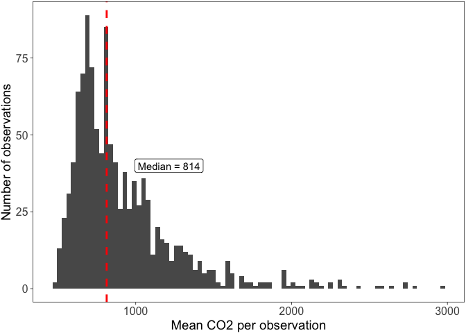
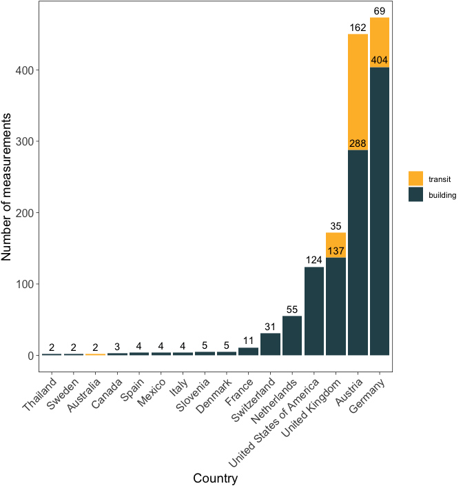
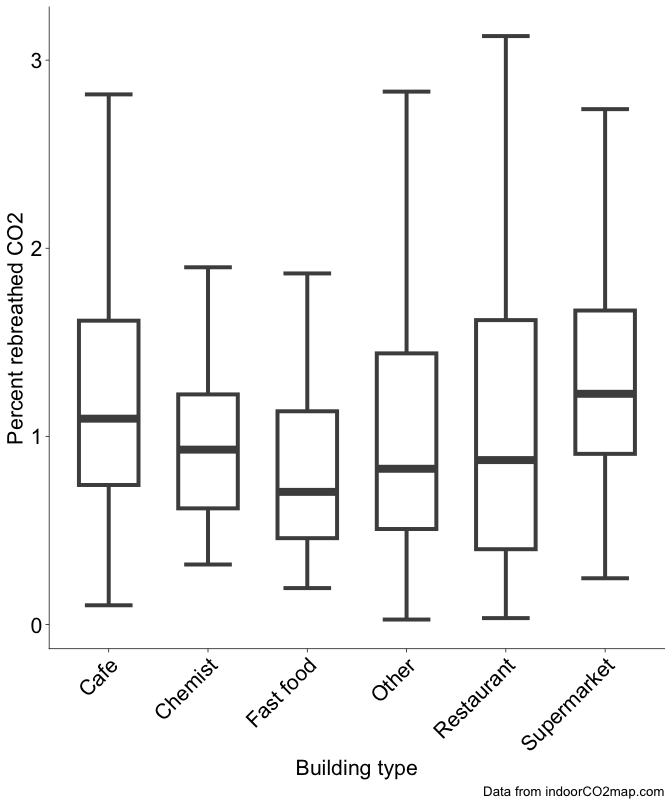
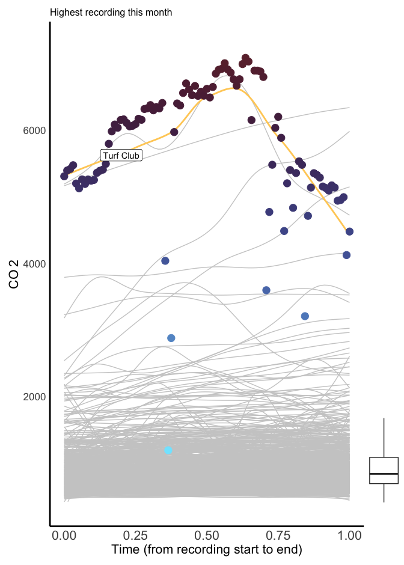
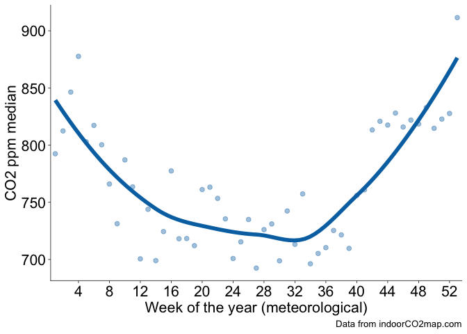
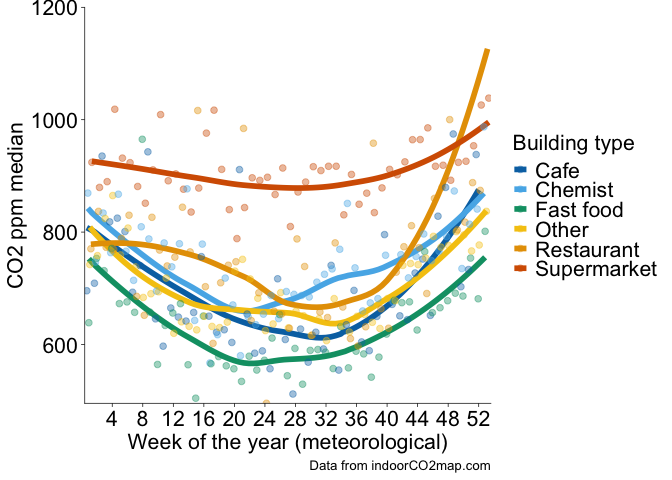
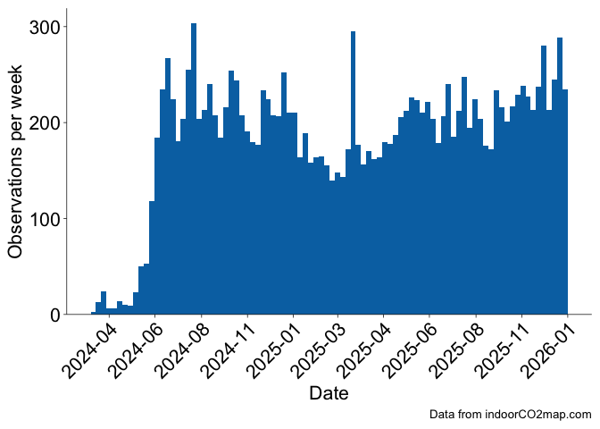
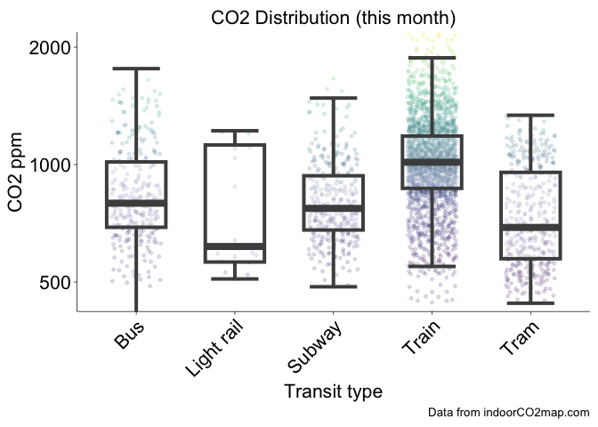
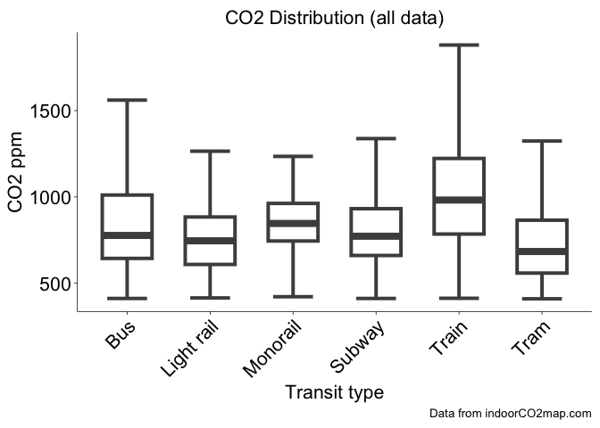

# Monthly indoorCO2map.com summary December 2025

There is a well documented relationship between indoor levels of
CO2 and the amount of ventilation in indoor environments.
Buildings with high indoor levels of CO2 have poor
ventilation and are therefore more likely to be vectors of airborne
diseases (like COVID-19, Measles, and Flu) and to trap indoor
pollutants.

Measuring CO2 inside is a really cheap way of measuring the
air quality in indoor environments. When we breathe, we exhale
CO2 and it gets trapped inside the room we are in. If the
building has good ventilation it will leave quickly. If it has bad
ventilation, it stays in the room and builds up.

If there is bad ventilation, then smoke from cooking can build up and
that’s bad for you. Same thing for VOCs from perfumes, as well as gas
leaks, radon, and mold spores. At high concentrations in artificial
environments, they contribute to all sorts of things: cancer,
Alzheimer’s, Parkinson’s, childhood asthma, childhood lung problems, and
heart conditions. Bad ventilation also contributes to a much higher risk
of respiratory infections. If someone who is sick breathes in a badly
ventilated room, the infectious aerosols will float around in the room
until someone breathes them in. In a well ventilated space, they are
dispersed very quickly and the risk of infection is much lower. Having
an open window in a classroom (or having an air filter), for instance,
reduces school absences significantly.

CO2 levels outside are typically around 420 parts per million
(ppm), so if we measure the CO2 in a room and it is higher
than that, you know its not ventilating much. Anywhere from 400 - 600
ppm are considered well ventilated. Every indoor environment is going to
trap some CO2 and that’s okay. Levels between 600 ppm and
1000 ppm may need some improvement. Anything above 1000 ppm is generally
considered bad and should certainly be improved in some manner.

[Indoor CO2-Map](https://indoorco2map.com) is a community science
project to monitor indoor CO2 levels in non-residential
buildings and transit systems around the world. Since April 2024
volunteers have brought CO2 monitors into cafes, shops,
schools, trains, and all sorts of other places to monitor CO2
levels in them and upload them to a public database.

The following is a monthly summary of how this project is going.

## Buildings

This month there were 1186 measurements of 966 unique buildings.

(**cr-ccplot?**)

The most measured buildings were Natur & Wellnesshotel Höflehner, a
hotel in Bezirk Liezen, Österreich (min: 873, mean: 1128, max: 1373) and
REWE, a supermarket in Leipzig, Deutschland (min: 1359, mean: 1454, max:
1599), which were measured 9 times each.

There were measurements in 24 separate countries. Additionally, the
first measurement was added in Mexico this month. Welcome to the
glorious world of CO2 monitoring Mexico!

(**cr-histco2plot?**)

Here is a graph that shows the distribution of all the CO2
measurements this month. The dashed red line shows the median which was
813 ppm. There are many measurements in the range that we would consider
good CO2 levels, however, you’ll notice that there are also a
good number of measurements that are over 1000 ppm, which really should
be addressed.

(**cr-buildingtypes?**)

This graph shows the distribution of the most common building types in
the month of December. The dark bar in the middle of each box and
whisker plot shows the median value for each category. The rest of the
lines show the range of the distribution. Most of the values fall within
each box. If you want more information about how to interpret this
graph, watch [this
video](https://youtu.be/b2C9I8HuCe4?si=73FKu7wSJr1rWwWt).

As is common, supermarkets tend to have higher CO2 values
than other types of buildings. I’ve converted those CO2
values to the percentage of rebreathed air, which specifies how much of
each breath you take has already been exhaled by someone else.

Here is a graph of all the recordings that happened this month shown by
the grey curves. I’ve highlighted the highest one. (**cr-allcurves?**)

The building with the highest measured CO2 levels was Turf
Club in Saint Paul, United States with a median CO2 value of
6029 ppm. While this is incredibly high, it is important to realize that
this is an outlier. The majority of measurements are much lower than
this. There is a boxplot to the right of the graph which shows where the
majority of measurements fall.

The building with the lowest measured CO2 levels was Tilley &
Grace in East Suffolk, United Kingdom with a median CO2 value
of 490 ppm. There were some measurements that were even lower than this,
but we have removed them from this analysis. Generally outdoor
CO2 levels don’t go below 410 ppm, therefore we have removed
any datapoints that are below 400 ppm. If your CO2 monitor
consistently shows levels below 410 ppm while you are inside or outside,
it is likely that your monitor needs recalibrating.

Here is a chart showing the 4 measurements that had a median
CO2 value under 500. Keep in mind that some of these are
potentially miscalibrated sensors or erroneous recordings where the
sensor was outside. However, it is important to celebrate the places
that do in fact have well ventilated spaces.

| Measurements under 500 ppm |         |               |                              |
|----------------------------|---------|---------------|------------------------------|
| Name                       | CO2 ppm | Building type | Location                     |
| Fat Face                   | 499     | Clothes       | East Suffolk, United Kingdom |
| Seasalt                    | 492     | Clothes       | East Suffolk, United Kingdom |
| Tilley & Grace             | 490     | Clothes       | East Suffolk, United Kingdom |
| Treats                     | 499     | Ice cream     | Nevada County, United States |

## Trends over time

The following are charts that are updated every month, but they reflect
all data collected so far from the indoorco2 monitoring project (since
April 2024). Over time, we should be able to see yearly trends where
CO2 levels are higher in the Winter when shopkeepers close
their windows to keep things warm and then lower CO2 levels
when shopkeepers open their windows in the Summer.

(**cr-metweekall?**)

We can start to see trends like in this graph which shows CO2
against the week of the year. There are two relevant points you should
know about the X axis, `Week of the year (meteorological)`, before
moving on.

1.  Datapoints are aggregated into weeks regardless of the year they are
    collected in, so some weeks were measured in both 2024 and 2025 but
    they would both show up in the same week number.

2.  This takes account of the hemisphere in which the recording was
    collected. Since Winter in the Southern Hemisphere is June through
    August, while Winter in the Northern Hemisphere is December through
    February, we have adjusted the week numbers so that they line up
    meterologically. Essentially, a measurement collected in the
    Northern Hemisphere on the first of January would show up as week 1,
    however, a measurement collected in the Southern Hemisphere on the
    first of January would show up as week 27.

(**cr-metweektype?**)

If we split the graph by the most popular building types, we can start
to see some interesting trends. Supermarkets remain relatively high
throughout the year with little variation while fast food, and chemists
have quite a strong dip in CO2 levels during the Summer. This
may be because most supermarkets keep their doors closed throughout the
year and they tend to have larger buildings; conversely, chemists and
fast food restaurants tend to be small to medium sized buildings which
means that they can be very easily ventilated if they leave their front
door open in the Summer. Restaurants have a very interesting trend here,
the strong upward trend of the model at the end of the year is probably
due to not enough measurements of restaurants yet rather that there
being any meaningful conclusions. Over time we should hopefully see more
stable trends show up.

Here’s a histogram showing how many measurements have been recorded each
week since the start of the project. Over the last 12 months there have
been 10449 building measurements which is 871 per month or 201 per week.
(**cr-allhist?**)

## Transit

This month there were 290 measurements of 125 unique transit lines. The
most measured transit line was subway U6 in the U-Bahn Wien transit
network in Wien, Österreich (min: 448, mean: 682, max: 998), which was
measured 31 times. This graph shows the number of transit recordings in
each transit network during the last month. Keep in mind that this graph
only shows networks with more than 2 transit recordings this month
(there were quite a few with one or two). Transit recordings seem very
popular in Vienna at the moment. (**cr-transitcount?**)

When we look at the distribution of CO2 measurements by the
transit type this month we can see some patterns. Trains often have
higher CO2 values than buses, subways and trams because they
usually travel for longer distances between stations. This causes trains
to rely more heavily on mechanical ventilation than buses, subways, and
trams which open their doors at stations more frequently.
(**cr-transitmonthbox?**)

This trend can also be seen when we look at the distribution of each
transit type on all the data from 2024 and 2025. (**cr-transitallbox?**)

That’s all for this month! Check back soon for more updates.

### Some thanks

This work would not be possible without the hard work of all the
contributors to [OpenStreetMap](https://www.openstreetmap.org/) and
[indoorco2map](https://indoorco2map.com). If you would like to
contribute to either of these projects, please visit their websites. You
can contribute to the indoorco2map by downloading the [Android
app](https://play.google.com/store/apps/details?id=com.aurelwu.indoorairqualitycollector&pcampaignid=pcampaignidMKT-Other-global-all-co-prtnr-py-PartBadge-Mar2515-1)
or [iOS
app](https://apps.apple.com/us/app/indoorco2map-data-collector/id6504560820?itscg=30200&itsct=apps_box_badge&mttnsubad=6504560820)
and connecting it to any one of the following CO2 sensors:
Aranet4, Airvalent, AirSpot and Inkbird IAM-T1. You can also donate by
contributing to the [indoorCO2map
gofundme](https://www.gofundme.com/f/indoorco2mapcom-collectively-measuring-indoor-air-quality).  
I would also like to thank [Aurel Wünsch](https://github.com/AurelWu)
who tirelessly works on the project as well as the other contributors to
the project [ahunt](https://github.com/ahunt),
[da5nsy](https://github.com/da5nsy),
[paul-hammant](https://github.com/paul-hammant), and
[samherniman](https://github.com/samherniman).

Finally, many thanks go to the teams who work on the following software,
which I used heavily.

We used R v. 4.4.3 (R Core Team 2025) and the following R packages:
autocruller v. 0.0.0.9000 (Herniman, n.d.), dbscan v. 1.2.3 (Hahsler,
Piekenbrock, and Doran 2019; Hahsler and Piekenbrock 2025), duckplyr v.
1.1.3.9005 (Mühleisen and Müller 2025), ggrepel v. 0.9.6 (Slowikowski
2024), glue v. 1.8.0 (Hester and Bryan 2024), gt v. 1.0.0 (Iannone et
al. 2025), h3 v. 3.7.2 (Kuethe 2022), here v. 1.0.1 (Müller 2020),
mapview v. 2.11.2 (Appelhans et al. 2023), osmdata v. 0.2.5 (Mark
Padgham et al. 2017), pak v. 0.9.0 (Csárdi and Hester 2025), patchwork
v. 1.3.1 (Pedersen 2025), rmarkdown v. 2.30 (Xie, Allaire, and Grolemund
2018; Xie, Dervieux, and Riederer 2020; Allaire et al. 2025),
rnaturalearth v. 1.1.0 (Massicotte and South 2025), scales v. 1.4.0
(Wickham, Pedersen, and Seidel 2025), scico v. 1.5.0 (Pedersen and
Crameri 2023), sf v. 1.0.22 (Pebesma 2018; Pebesma and Bivand 2023),
tidygeocoder v. 1.0.6 (Cambon et al. 2021), tidyplots v. 0.2.2.9000
(Engler 2025), tidyverse v. 2.0.0 (Wickham et al. 2019).

All figures in this report are licensed under
<a href="https://creativecommons.org/licenses/by-sa/4.0/">CC BY-SA
4.0</a>.
Please feel free to use and remix them and let me know if you do. I love
to see my work being used elsewhere!

If this was useful to you, please consider [supporting
me](https://liberapay.com/samherniman/) so I can make more things like
this. I would be incredibly grateful.

<noscript>

</noscript>

Allaire, JJ, Yihui Xie, Christophe Dervieux, Jonathan McPherson, Javier
Luraschi, Kevin Ushey, Aron Atkins, et al. 2025.
*rmarkdown: Dynamic Documents for r*.
<https://github.com/rstudio/rmarkdown>.

Appelhans, Tim, Florian Detsch, Christoph Reudenbach, and Stefan
Woellauer. 2023. *mapview: Interactive
Viewing of Spatial Data in r*.
<https://CRAN.R-project.org/package=mapview>.

Cambon, Jesse, Diego Hernangómez, Christopher Belanger, and Daniel
Possenriede. 2021. “tidygeocoder: An r
Package for Geocoding.” *Journal of Open Source Software* 6 (65): 3544.
<https://doi.org/10.21105/joss.03544>.

Csárdi, Gábor, and Jim Hester. 2025. *pak:
Another Approach to Package Installation*.
<https://CRAN.R-project.org/package=pak>.

Engler, Jan Broder. 2025. “Tidyplots Empowers Life Scientists with Easy
Code-Based Data Visualization.” *iMeta*, e70018.
https://doi.org/<https://doi.org/10.1002/imt2.70018>.

Hahsler, Michael, and Matthew Piekenbrock. 2025.
*dbscan: Density-Based Spatial Clustering of
Applications with Noise (DBSCAN) and Related Algorithms*.
<https://CRAN.R-project.org/package=dbscan>.

Hahsler, Michael, Matthew Piekenbrock, and Derek Doran. 2019.
“dbscan: Fast Density-Based Clustering with
R.” *Journal of Statistical Software* 91 (1): 1–30.
<https://doi.org/10.18637/jss.v091.i01>.

Herniman, Sam. n.d. *autocruller: Tools to
Download and Analyze indoorCO2map Data*.
<https://samherniman.github.io/autocruller/>.

Hester, Jim, and Jennifer Bryan. 2024.
*glue: Interpreted String Literals*.
<https://CRAN.R-project.org/package=glue>.

Iannone, Richard, Joe Cheng, Barret Schloerke, Ellis Hughes, Alexandra
Lauer, JooYoung Seo, Ken Brevoort, and Olivier Roy. 2025.
*gt: Easily Create Presentation-Ready
Display Tables*. <https://CRAN.R-project.org/package=gt>.

Kuethe, Stefan. 2022. *H3: R Bindings for H3*.
<https://github.com/crazycapivara/h3-r>.

Mark Padgham, Bob Rudis, Robin Lovelace, and Maëlle Salmon. 2017.
“Osmdata.” *Journal of Open Source Software* 2 (14): 305.
<https://doi.org/10.21105/joss.00305>.

Massicotte, Philippe, and Andy South. 2025.
*rnaturalearth: World Map Data from Natural
Earth*. <https://CRAN.R-project.org/package=rnaturalearth>.

Mühleisen, Hannes, and Kirill Müller. 2025.
*duckplyr: A “DuckDB”-Backed Version of
“dplyr”*.
<https://github.com/tidyverse/duckplyr>.

Müller, Kirill. 2020. *here: A Simpler Way
to Find Your Files*. <https://CRAN.R-project.org/package=here>.

Pebesma, Edzer. 2018. “Simple Features for R:
Standardized Support for Spatial Vector Data.” *The R Journal* 10
(1): 439–46. <https://doi.org/10.32614/RJ-2018-009>.

Pebesma, Edzer, and Roger Bivand. 2023. *Spatial
Data Science: With applications in R*. Chapman and Hall/CRC.
<https://doi.org/10.1201/9780429459016>.

Pedersen, Thomas Lin. 2025. *patchwork: The
Composer of Plots*. <https://CRAN.R-project.org/package=patchwork>.

Pedersen, Thomas Lin, and Fabio Crameri. 2023.
*scico: Colour Palettes Based on the
Scientific Colour-Maps*. <https://CRAN.R-project.org/package=scico>.

R Core Team. 2025. *R: A Language and Environment for Statistical
Computing*. Vienna, Austria: R Foundation for Statistical Computing.
<https://www.R-project.org/>.

Slowikowski, Kamil. 2024. *ggrepel:
Automatically Position Non-Overlapping Text Labels with
“ggplot2”*.
<https://CRAN.R-project.org/package=ggrepel>.

Wickham, Hadley, Mara Averick, Jennifer Bryan, Winston Chang, Lucy
D’Agostino McGowan, Romain François, Garrett Grolemund, et al. 2019.
“Welcome to the tidyverse.” *Journal of Open
Source Software* 4 (43): 1686. <https://doi.org/10.21105/joss.01686>.

Wickham, Hadley, Thomas Lin Pedersen, and Dana Seidel. 2025.
*scales: Scale Functions for Visualization*.
<https://CRAN.R-project.org/package=scales>.

Xie, Yihui, J. J. Allaire, and Garrett Grolemund. 2018. *R Markdown: The
Definitive Guide*. Boca Raton, Florida: Chapman; Hall/CRC.
<https://bookdown.org/yihui/rmarkdown>.

Xie, Yihui, Christophe Dervieux, and Emily Riederer. 2020. *R Markdown
Cookbook*. Boca Raton, Florida: Chapman; Hall/CRC.
<https://bookdown.org/yihui/rmarkdown-cookbook>.

