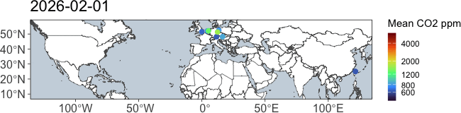
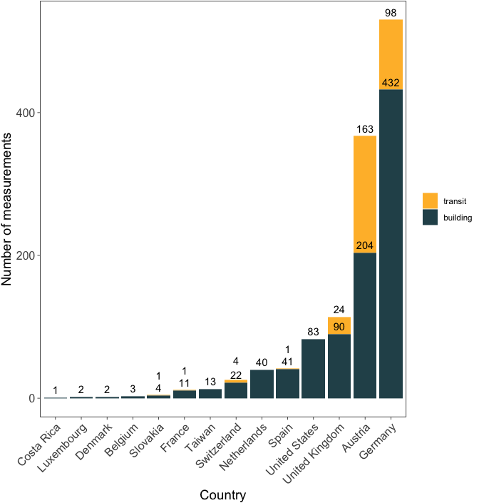

# Monthly indoorCO2map.com summary January 2026

There is a well documented relationship between indoor levels of
CO2 and the amount of ventilation in indoor environments.
Buildings with high indoor levels of CO2 have poor
ventilation and are therefore more likely to be vectors of airborne
diseases (like COVID-19, Measles, and Flu) and to trap indoor
pollutants.

Measuring CO2 inside is a cheap way of measuring the air
quality in indoor environments. When we breathe, we exhale
CO2 and it gets trapped inside the room we are in. If the
building has good ventilation it will leave quickly. If it has bad
ventilation, it stays in the room and builds up.

If there is bad ventilation, then smoke from cooking can build up and
that’s bad for you. Same thing for VOCs from perfumes, as well as gas
leaks, radon, and mold spores. At high concentrations in artificial
environments, they contribute to all sorts of things:
cancer1, Alzheimer’s2–4, Parkinson’s3,
childhood asthma5–9, childhood lung problems10,11,
and heart conditions12. Bad ventilation also contributes to a
much higher risk of respiratory infections. If someone who is sick
breathes in a badly ventilated room, the infectious aerosols will float
around in the room until someone breathes them in. In a well ventilated
space, they are dispersed very quickly and the risk of infection is much
lower. Having an open window in a classroom (or having an air filter),
for instance, reduces school absences significantly.

CO2 levels outside are typically around 420 parts per million
(ppm), so if we measure the CO2 in a room and it is higher
than that, you know its not ventilating much. Anywhere from 400 - 600
ppm are considered well ventilated. Every indoor environment is going to
trap some CO2 and that’s okay. Levels between 600 ppm and
1000 ppm may need some improvement. Anything above 1000 ppm is generally
considered bad and should certainly be improved in some manner.

[Indoor CO2-Map](https://indoorco2map.com) is a community science
project to monitor indoor CO2 levels in non-residential
buildings and transit systems around the world. Since April 2024
volunteers have brought CO2 monitors into cafes, shops,
schools, trains, and all sorts of other places to monitor CO2
levels in them and upload them to a public database.

The following is a monthly summary of how this project is going.

## Buildings

This month there were 963 measurements of 739 unique buildings.

**cr-ccplot?**

The most measured building was Rewe, a supermarket in Kassel, Germany
(min: 682, mean: 773, max: 844), which was measured 13 times.

There were measurements in 24 separate countries. Additionally, the
first measurement was added in Taiwan this month. Welcome to the
glorious world of CO2 monitoring Taiwan!

**cr-histco2plot?**

Here is a graph that shows the distribution of all the CO2
measurements this month. The dashed red line shows the median which was
846 ppm. There are many measurements that we would consider good
CO2 levels, however, you’ll notice that about 32 percent are
over 1000 ppm, which really should be addressed.

**cr-buildingtypes?**

This graph shows the distribution of the most common building types in
the month of January. The dark bar in the middle of each box and whisker
plot shows the median value for each category. The rest of the lines
show the range of the distribution. Most of the values fall within each
box. If you want more information about how to interpret this graph,
watch [this video](https://youtu.be/b2C9I8HuCe4?si=73FKu7wSJr1rWwWt).

As is common, supermarkets tend to have higher CO2 values
than other types of buildings. I’ve converted those CO2
values to the percentage of rebreathed air, which specifies how much of
each breath you take has already been exhaled by someone else.

Here is a graph of all the recordings that happened this month shown by
the grey curves. I’ve highlighted the highest
one.**cr-allcurves?**

The building with the highest measured CO2 levels was
CineStar in Saarbrücken, Germany with a median CO2 value of
6593 ppm. While this is incredibly high, it is important to realize that
this is an outlier. The majority of measurements are much lower than
this. There is a boxplot to the right of the graph which shows where the
majority of measurements fall.

The building with the lowest measured CO2 levels was Lidl in
Wolfsberg, Austria with a median CO2 value of 419.5 ppm.
There were some measurements that were even lower than this, but we have
removed them from this analysis. Generally outdoor CO2 levels
don’t go below 410 ppm, therefore we have removed any datapoints that
are below 400 ppm. If your CO2 monitor consistently shows
levels below 410 ppm while you are inside or outside, it is likely that
your monitor needs recalibrating.

Here is a chart showing the 7 measurements that had a median
CO2 value under 500. Keep in mind that some of these are
potentially miscalibrated sensors or erroneous recordings where the
sensor was outside. However, it is important to celebrate the places
that do in fact have well ventilated spaces.

| Measurements under 500 ppm |         |               |                                |
|----------------------------|---------|---------------|--------------------------------|
| Name                       | CO2 ppm | Building type | Location                       |
| ESO Supernova Planetarium  | 494.0   | Planetarium   | Garching bei München, Germany  |
| CVS Pharmacy               | 493.0   | Pharmacy      | Iowa City, United States       |
| Liverpool Street           | 489.0   |               | City of London, United Kingdom |
| Rådhuspladsen              | 443.0   | Station       | København, NA                  |
| 了凡油雞飯.麵              | 483.0   | Restaurant    | 桃園市, Taiwan                 |
| Lidl                       | 419.5   | Supermarket   | Wolfsberg, Austria             |
| Palí                       | 475.0   | Supermarket   | La Fortuna, Costa Rica         |

## Trends over time

The following are charts that are updated every month, but they reflect
all data collected so far from the indoorco2 monitoring project (since
April 2024). Over time, we should be able to see yearly trends where
CO2 levels are higher in the Winter when shopkeepers close
their windows to keep things warm and then lower CO2 levels
when shopkeepers open their windows in the Summer.

**cr-metweekall?**

We can start to see trends like in this graph which shows CO2
against the week of the year. There are two relevant points you should
know about the X axis, `Week of the year (meteorological)`, before
moving on.

1.  Datapoints are aggregated into weeks regardless of the year they are
    collected in, so some weeks were measured in 2024, 2025 and 2026 but
    they would all show up in the same week number.

2.  This accounts for the hemisphere in which the recording was
    collected. Since Winter in the Southern Hemisphere is June through
    August, while Winter in the Northern Hemisphere is December through
    February, we have adjusted the week numbers so that they line up
    meterologically. Essentially, a measurement collected in the
    Northern Hemisphere on the first of January would show up as week 1,
    however, a measurement collected in the Southern Hemisphere on the
    first of January would show up as week 27.

**cr-metweektype?**

If we split the graph by the most popular building types, we can start
to see some interesting trends. Supermarkets remain relatively high
throughout the year with little variation while fast food, and chemists
have quite a strong dip in CO2 levels during the Summer. This
may be because most supermarkets keep their doors closed throughout the
year and they tend to have larger buildings; conversely, chemists and
fast food restaurants tend to be small to medium sized buildings which
means that they can be very easily ventilated if they leave their front
door open in the Summer. Restaurants have a very interesting trend here,
the strong upward trend of the model at the end of the year is probably
due to not enough measurements of restaurants yet rather that there
being any meaningful conclusions. Over time we should hopefully see more
stable trends show up.

Here’s a histogram showing how many measurements have been recorded each
week since the start of the project. Over the last 12 months there have
been 10707 building measurements which is 892 per month or 206 per
week.**cr-allhist?**

## Transit

This month there were 341 measurements of 169 unique transit lines. The
most measured transit line was subway U6 in the U-Bahn Wien transit
network in Wien, Austria (min: 491, mean: 737, max: 1187), which was
measured 20 times. This graph shows the number of transit recordings in
each transit network during the last month. Keep in mind that this graph
only shows networks with more than 2 transit recordings this month
(there were quite a few with one or two). Transit recordings seem very
popular in Vienna at the moment.**cr-transitcount?**

When we look at the distribution of CO2 measurements by the
transit type this month we can see some patterns. Trains often have
higher CO2 values than buses, subways and trams because they
usually travel for longer distances between stations. This causes trains
to rely more heavily on mechanical ventilation than buses, subways, and
trams which open their doors at stations more
frequently.**cr-transitmonthbox?**

This trend can also be seen when we look at the distribution of each
transit type on all the data from 2024, 2025 and
2026.**cr-transitallbox?**

That’s all for this month! Check back soon for more updates.

If this was useful to you, please consider [supporting
me](https://liberapay.com/samherniman/) so I can make more things like
this. I would be incredibly grateful.

<noscript>

</noscript>

### Some news

Recently Aurel Wünsch and I gave a talk about this project at Fluconf
2026. Check out the [recording
here](https://www.youtube.com/live/60YwSH9g3Bg?si=RAdTgYvftXXevaIa), and
the [companion website
here](https://samherniman.github.io/Fluconf2026-indoorco2map/abstract.html).

<iframe width="560" height="315" src="https://www.youtube-nocookie.com/embed/60YwSH9g3Bg?si=WsgFugFTD8ozkfF6" title="YouTube video player" frameborder="0" allow="accelerometer; autoplay; clipboard-write; encrypted-media; gyroscope; picture-in-picture; web-share" referrerpolicy="strict-origin-when-cross-origin" allowfullscreen>
</iframe>

I was also interviewed for a podcast. You can listen to the [recording
here](https://soundcloud.com/modulator-69529428/the-indoor-co2-map-community-science-in-the-pandemicene?si=c21857205e794f34998da835bf581d61&utm_source=clipboard&utm_medium=text&utm_campaign=social_sharing).

<iframe width="100%" height="166" scrolling="no" frameborder="no" allow="autoplay" src="https://w.soundcloud.com/player/?url=https%3A//api.soundcloud.com/tracks/soundcloud%253Atracks%253A2258686259&amp;color=%23ff5500&amp;auto_play=false&amp;hide_related=false&amp;show_comments=true&amp;show_user=true&amp;show_reposts=false&amp;show_teaser=true">
</iframe>

<a href="https://soundcloud.com/modulator-69529428" title="modulator" target="_blank" style="color: #cccccc; text-decoration: none;">modulator</a>
·
<a href="https://soundcloud.com/modulator-69529428/the-indoor-co2-map-community-science-in-the-pandemicene" title="The Indoor CO2 Map: Community Science in the Pandemicene" target="_blank" style="color: #cccccc; text-decoration: none;">The
Indoor CO2 Map: Community Science in the Pandemicene</a>

### Some thanks

This work would not be possible without the hard work of all the
contributors to [OpenStreetMap](https://www.openstreetmap.org/) and
[indoorco2map](https://indoorco2map.com). If you would like to
contribute to either of these projects, please visit their websites. You
can contribute to the indoorco2map by downloading the [Android
app](https://play.google.com/store/apps/details?id=com.aurelwu.indoorairqualitycollector&pcampaignid=pcampaignidMKT-Other-global-all-co-prtnr-py-PartBadge-Mar2515-1)
or [iOS
app](https://apps.apple.com/us/app/indoorco2map-data-collector/id6504560820?itscg=30200&itsct=apps_box_badge&mttnsubad=6504560820)
and connecting it to any one of the following CO2 sensors:
[Aranet4](https://www.aranet.com/en/home/products/aranet4-home),
[Airvalent](https://airvalent.com/),
[AirSpot](https://airspothealth.com/products/airspot-copy) and [Inkbird
IAM-T1](https://www.inkbird.com/products/smart-indoor-air-quality-monitor-iam-t1).
You can also donate by contributing to the [indoorCO2map
gofundme](https://www.gofundme.com/f/indoorco2mapcom-collectively-measuring-indoor-air-quality).  
I would also like to thank [Aurel Wünsch](https://github.com/AurelWu)
who tirelessly works on the project as well as the other contributors to
the project [ahunt](https://github.com/ahunt),
[da5nsy](https://github.com/da5nsy),
[paul-hammant](https://github.com/paul-hammant), and
[samherniman](https://github.com/samherniman).

Finally, many thanks go to the teams who work on the following software,
which I used heavily.

We used R v. 4.4.313 and the following R packages:
autocruller v. 0.0.0.900014, dbscan v. 1.2.415,16,
duckplyr v. 1.1.3.900717, gganimate v. 1.0.1118,
ggrepel v. 0.9.619, glue v. 1.8.020, gt v.
1.2.021, h3 v. 3.7.222, here v.
1.0.223, mapview v. 2.11.424, osmdata v.
0.3.025, pak v. 0.9.226, patchwork v.
1.3.227, rmarkdown v. 2.3028–30, rnaturalearth v.
1.2.031, rnaturalearthhires v. 1.0.0.900032,
scales v. 1.4.033, scico v. 1.5.034, sf v.
1.0.2435,36, tidygeocoder v. 1.0.637, tidyplots v.
0.4.038, tidyverse v. 2.0.039.

All figures in this report are licensed under
<a href="https://creativecommons.org/licenses/by-sa/4.0/">CC BY-SA
4.0</a>.
Please feel free to use and remix them and let me know if you do. I love
to see my work being used elsewhere!

1.
Guzman, R. D. & Schiller, J. [Air
pollution and its impact on cancer incidence, cancer care and cancer
outcomes](https://doi.org/10.1136/bmjonc-2024-000535). *bmjonc* **4**,
(2025).

2.
Fu, P. & Yung, K. K. L. [Air
pollution and alzheimer’s disease: A systematic review and
meta-analysis](https://doi.org/10.3233/JAD-200483). *Journal of
Alzheimer’s Disease* **77**, 701–714 (2020).

3.
Shi, L. *et al.* [Long-term
effects of PM2·5 on neurological disorders in the american medicare
population: A longitudinal cohort
study](https://doi.org/10.1016/S2542-5196(20)30227-8). *Lancet Planet
Health* **4**, e557–e565 (2020).

4.
Olloquequi, J. *et al.* [From
inhalation to neurodegeneration: Air pollution as a modifiable risk
factor for alzheimer’s disease](https://doi.org/10.3390/ijms25136928).
*International Journal of Molecular Sciences* **25**, 6928
(2024).

5.
Akar-Ghibril, N. & Phipatanakul,
W. [The indoor environment and childhood
asthma](https://doi.org/10.1007/s11882-020-00941-5). *Curr Allergy
Asthma Rep* **20**, 43 (2020).

6.
Rosser, F. *et al.* [Air quality
index and emergency department visits and hospitalizations for childhood
asthma](https://doi.org/10.1513/AnnalsATS.202105-539OC). *Annals ATS*
**19**, 1139–1148 (2022).

7.
Pan, R. *et al.* [Interactions
between climate factors and air quality index for improved childhood
asthma
self-management](https://doi.org/10.1016/j.scitotenv.2020.137804).
*Science of The Total Environment* **723**, 137804 (2020).

8.
Breysse, P. N. *et al.* [Indoor
air pollution and asthma in
children](https://doi.org/10.1513/pats.200908-083RM). *Proc Am Thorac
Soc* **7**, 102–106 (2010).

9.
Hulin, M., Caillaud, D. &
Annesi-Maesano, I. [Indoor air pollution and childhood asthma:
Variations between urban and rural
areas](https://doi.org/10.1111/j.1600-0668.2010.00673.x). *Indoor Air*
**20**, 502–514 (2010).

10.
Maung, T. Z., Bishop, J. E., Holt,
E., Turner, A. M. & Pfrang, C. [Indoor air pollution and the health of
vulnerable groups: A systematic review focused on particulate matter
(PM), volatile organic compounds (VOCs) and their effects on children
and people with pre-existing lung
disease](https://doi.org/10.3390/ijerph19148752). *International Journal
of Environmental Research and Public Health* **19**, 8752 (2022).

11.
Kurmi, O. P., Lam, K. B. H. &
Ayres, J. G. [Indoor air pollution and the lung in low- and
medium-income countries](https://doi.org/10.1183/09031936.00190211).
*European Respiratory Journal* **40**, 239–254 (2012).

12.
Uzoigwe, J. C., Prum, T.,
Bresnahan, E. & Garelnabi, M. [The emerging role of outdoor and indoor
air pollution in cardiovascular
disease](https://doi.org/10.4103/1947-2714.117290). *N Am J Med Sci*
**5**, 445–453 (2013).

13.
R Core Team. *[R: A Language and
Environment for Statistical Computing](https://www.R-project.org/)*. (R
Foundation for Statistical Computing, Vienna, Austria, 2025).

14.
Herniman, S.
*[autocruller: Tools to Download and Analyze
indoorCO2map Data](https://samherniman.github.io/autocruller/)*.

15.
Hahsler, M., Piekenbrock, M. &
Doran, D. [dbscan: Fast density-based
clustering with R](https://doi.org/10.18637/jss.v091.i01). *Journal of
Statistical Software* **91**, 1–30 (2019).

16.
Hahsler, M. & Piekenbrock, M.
*[dbscan: Density-Based Spatial Clustering
of Applications with Noise (DBSCAN) and Related
Algorithms](https://CRAN.R-project.org/package=dbscan)*. (2025).

17.
Mühleisen, H. & Müller, K.
*[duckplyr: A ‘DuckDB’-Backed Version of
‘dplyr’](https://github.com/tidyverse/duckplyr)*.

18.
Pedersen, T. L. & Robinson, D.
*[gganimate: A Grammar of Animated
Graphics](https://CRAN.R-project.org/package=gganimate)*. (2025).

19.
Slowikowski, K.
*[ggrepel: Automatically Position
Non-Overlapping Text Labels with
‘ggplot2’](https://CRAN.R-project.org/package=ggrepel)*.
(2024).

20.
Hester, J. & Bryan, J.
*[glue: Interpreted String
Literals](https://CRAN.R-project.org/package=glue)*. (2024).

21.
Iannone, R. *et al.*
*[gt: Easily Create Presentation-Ready
Display Tables](https://CRAN.R-project.org/package=gt)*. (2025).

22.
Kuethe, S. *[H3: R Bindings for
H3](https://github.com/crazycapivara/h3-r)*. (2022).

23.
Müller, K.
*[here: A Simpler Way to Find Your
Files](https://CRAN.R-project.org/package=here)*. (2025).

24.
Appelhans, T., Detsch, F.,
Reudenbach, C. & Woellauer, S. *[mapview:
Interactive Viewing of Spatial Data in
r](https://CRAN.R-project.org/package=mapview)*. (2025).

25.
Mark Padgham, Bob Rudis, Robin
Lovelace & Maëlle Salmon.
[Osmdata](https://doi.org/10.21105/joss.00305). *Journal of Open Source
Software* **2**, 305 (2017).

26.
Csárdi, G. & Hester, J.
*[pak: Another Approach to Package
Installation](https://CRAN.R-project.org/package=pak)*. (2025).

27.
Pedersen, T. L.
*[patchwork: The Composer of
Plots](https://CRAN.R-project.org/package=patchwork)*. (2025).

28.
Xie, Y., Allaire, J. J. &
Grolemund, G. *[R Markdown: The Definitive
Guide](https://bookdown.org/yihui/rmarkdown)*. (Chapman; Hall/CRC, Boca
Raton, Florida, 2018).

29.
Xie, Y., Dervieux, C. & Riederer,
E. *[R Markdown
Cookbook](https://bookdown.org/yihui/rmarkdown-cookbook)*. (Chapman;
Hall/CRC, Boca Raton, Florida, 2020).

30.
Allaire, J. *et al.*
*[rmarkdown: Dynamic Documents for
r](https://github.com/rstudio/rmarkdown)*. (2025).

31.
Massicotte, P. & South, A.
*[rnaturalearth: World Map Data from Natural
Earth](https://CRAN.R-project.org/package=rnaturalearth)*.
(2026).

32.
South, A., Michael, S. &
Massicotte, P. *[rnaturalearthhires: High
Resolution World Vector Map Data from Natural Earth Used in
Rnaturalearth](https://github.com/ropensci/rnaturalearthhires)*.
(2025).

33.
Wickham, H., Pedersen, T. L. &
Seidel, D. *[scales: Scale Functions for
Visualization](https://CRAN.R-project.org/package=scales)*.
(2025).

34.
Pedersen, T. L. & Crameri, F.
*[scico: Colour Palettes Based on the
Scientific Colour-Maps](https://CRAN.R-project.org/package=scico)*.
(2023).

35.
Pebesma, E.
[Simple Features for R: Standardized Support for
Spatial Vector Data](https://doi.org/10.32614/RJ-2018-009). *The
R Journal* **10**, 439–446 (2018).

36.
Pebesma, E. & Bivand, R.
*Spatial Data Science: With applications in
R*. (Chapman and Hall/CRC, 2023).
doi:[10.1201/9780429459016](https://doi.org/10.1201/9780429459016).

37.
Cambon, J., Hernangómez, D.,
Belanger, C. & Possenriede, D.
[tidygeocoder: An r package for
geocoding](https://doi.org/10.21105/joss.03544). *Journal of Open Source
Software* **6**, 3544 (2021).

38.
Engler, J. B. Tidyplots empowers
life scientists with easy code-based data visualization. *iMeta* e70018
(2025)
doi:[10.1002/imt2.70018](https://doi.org/10.1002/imt2.70018).

39.
Wickham, H. *et al.* [Welcome to
the
tidyverse](https://doi.org/10.21105/joss.01686).
*Journal of Open Source Software* **4**, 1686 (2019).

